# Etsy ecosystem map

*Every surface that comes together in a Watermark & Hue component or listing: where each lives, what feeds it, and what it feeds. Live state at the bottom.*

> **Established September 2026 — living document, not a snapshot.** The `_2026-09` in the filename records when the map was established, not how long it is valid; it stays put so links keep working. The map is kept true by the monthly review ritual (§10a), and the FigJam board carries the version history.

*Diagram mirrors FigJam board `ln6p2z1vppiTdqDPNVdoOZ`, page v5 — the board is the primary review surface. The storefront appears twice by design: one WatermarkandHue shop, drawn as a read view (feeding sync + evaluation) and the storefront proper (receiving publishing) so the loop reads left-to-right without crossing connectors.*

```mermaid
flowchart LR
    subgraph dataMeasure ["Data and measurement"]
        etsyData(("Storefront (read view)"))
        supabase[("Durable store: Supabase, UI-light by design")]
        bookends[/"Manual bookends: Search Analytics, ads, statements"/]
        external[/"External: eRank, Marmalead, Google Ads"/]
        pulls[("Data pulls, Drive flat files")]
        experiments["Tag positioning A/B"]
        evaluation["Evaluation rubric, outlived ELK"]
        sweeps{{"Improvement sweeps"}}
    end

    subgraph designSystem ["Design system"]
        base["MVDS base + Etsy-specific extensions"]
        figmaFiles["Source art + asset files"]
        templates["Listing template system: Layouts set, 12 gallery-role variants + slots"]
        sayings["Full-shop libraries: Plant Markers sayings"]
        contentPrinciples["Content principles: copy rules, house style, alt-text templates"]
    end

    subgraph localstore ["Local storage"]
        compFiles[("Component SVGs + PDFs")]
        galleries[("Gallery folders")]
    end

    subgraph editing ["Content + Inventory"]
        compDb[("Product (component) registry")]
        listInv[("Listing preview + tweak surface")]
    end

    subgraph writing ["Authorship"]
        pullNotes["Distilled pull notes"]
        copy["Copy drafting + payloads"]
        review["Batch review deck"]
    end

    subgraph tooling ["Publishing"]
        applyCopy[["Apply copy"]]
        createDrafts[["Create drafts"]]
        uploadImages[["Upload images + alt"]]
    end

    etsyMain(("Storefront"))
    stitch["Stitch Check, in flight"]

    base -.->|"Image principles as components"| templates
    base -.-> contentPrinciples
    base -.->|"Future brand tier"| evaluation
    contentPrinciples -.->|"Governs"| copy
    etsyData -->|"Daily sync"| supabase
    etsyData -.->|"Reads listing"| evaluation
    supabase --> experiments
    bookends -->|"Capture ritual"| pulls
    external -->|"Capture ritual"| pulls
    experiments --> sweeps
    evaluation --> sweeps
    sweeps -->|"New designs"| figmaFiles
    sweeps -->|"Next copy round"| copy
    supabase -->|"Instrumented data"| pullNotes
    pulls -->|"Distill to model"| pullNotes
    supabase -->|"Mirror + comments"| listInv
    figmaFiles -->|"SVG ingest"| compFiles
    figmaFiles -->|"Artwork into slots"| templates
    templates -->|"Exports + bundle staging frames"| galleries
    sayings -->|"Full-shop product art"| compFiles
    compFiles -->|"Filed"| compDb
    compDb --- listInv
    galleries -->|"Gallery sync"| listInv
    listInv --> copy
    pullNotes --> copy
    copy --> review
    review -->|"Approved"| createDrafts
    copy --> applyCopy
    galleries --> uploadImages
    applyCopy --> etsyMain
    createDrafts --> etsyMain
    uploadImages --> etsyMain
    stitch -.->|"Machine files, later"| compFiles
```

## 1. Design system (today: Figma)

Not "design in Figma" — the **design system layer**: visual principles, assets, content principles, and styles as one domain, with Figma as its current home. MVDS is the base plus Etsy-specific extensions. The layer holds where artwork is born *and* where the **listing gallery template system lives** — the 12-role galleries in Drive are exports of `Layouts` instances composed in Figma, not ad-hoc renders. That Figma→Drive workflow is distinct from the code-side generators (`lib/etsy-listing-kit/generator.ts`'s 6-scene pack, `scenes.ts`'s 10-image ladder), which are a separate production path over the same template photography; the map keeps both traceable rather than crediting one with the other's output. The content principles (copy rules, house style, alt-text templates) belong to this layer too: Authorship (§5) is the drafting activity, this layer owns the rules that govern it.

**The written chapters** — codified 2026-09-16, the governing layer §10 used to call missing:

- [Image principles](shop-design-system/image-principles.md) — 10 principles: role-named layouts, slot discipline, sampled color, no fabricated copy, thumbnail distinguishability, composed bundles.
- [Content principles](shop-design-system/content-principles.md) — 13 principles: the title formula, tag discipline, description skeleton, alt-text templates, copy-never-retyped.

Each principle is a met/not-met statement carrying the artifact that justifies it. Drafting copy or generating images? Open the chapter that governs it before you start.

| Surface | Where | Role |
|---|---|---|
| Source art files | `2026 Xmas Cut Files` (Yojq1pGSXTFi5iZkowpMaa) and siblings | Raw designs; "Mode A external ingest" clones SVGs out without touching the source |
| Embroidery Components file | Collection rows (e.g. Holiday row 136:24455) | The design-side registry — each component filed under a collection |
| W+H Listing Generator — base patterns | ZZusgWsPM4Fz8YuhKxnD4R, `Embroidery Base Patterns` page | 2000×2000 exports that feed the mockup generator |
| W+H Listing Generator — `Layouts` component set | Same file, `Garden Components` page (node 2041:55504, set 2041:55505) | **The gallery template system**: 12 variants (Basic, Badge, Content Center/Bottom Left/Top Left, Recos 4up/2up/Hoop, Transferring patterns, FAQ 1–3) mapping ≈1:1 to the 12 gallery roles, each exposing `Slot-Background` / `Slot-BaseArtwork` plus shared Watermark, Banner, and Logo components |
| Full-shop libraries | Same page — Plant Markers/Sayings frames (Affirmations, Snark, Vegetables, Herbs) | The design system spans product lines beyond embroidery |
| Staging frames | Same page, `staging/<SKU>/` frames (e.g. WH-UN-B-7584) | Bundle galleries assembled from Layouts instances before export |

## 2. Product (component) registry — Notion Components DB

`Watermark & Hue / Components` (data source `c71245a1…`). One row per component: **Component SKU** (`BHD-<line>-<n>-<slug>`), collection tags, **deliverables checklist** (svg-master, printable-6in/8in) with a ready flag, **visual description** (the alt-text raw material), preview render, provenance notes (Figma node + Drive path), and a relation to its Listing Inventory row. This is the source of truth for *products*.

## 3. Local storage (today: Google Drive, beckharrisdesign account; the letterharris mount is a stale copy)

- `W+H Listings/W+H Components/<slug>/` — master SVGs, PDF deliverables.
- `W+H Listings/W+H Listings/<SKU>/` — the listing galleries: 37 SKU folders of role-named images (hero, lifestyle, scale, transferring, content-tl/center/bl, suggestions-4up, badge, faq-1..3); 33 complete, 4 with only the six photo-derived roles (WH-UN-S-3453/-8779/-CA26/-DF8E). `_staging/WH-UN-B-STAGING/` holds the composed Classics bundle set.
- Generation code: `lib/etsy-listing-kit/generator.ts` (6-scene pack from one design, W&H template photography in `assets/mockups/`), `scenes.ts` (10-image data-card ladder), `scripts/compose-classics-bundle.mjs` (bundle recompositions).

## 4. Content + Inventory (today: Notion Listing Inventory)

`Watermark & Hue / Listing Inventory` (data source `5326f9f7…`, DB `389a8c23…`). One row per listing, live or future: SKU formula (page-id last-4), Status, gallery flags and roles, Hero preview, **Images** (full 12-role galleries as of 2026-09-16 — 38 rows, synced by `scripts/notion-gallery-sync.mjs` + `scripts/run-gallery-sync.sh`), Etsy Listing ID/Title/URL (empty until live; filled by the sync once a listing exists). The authoring surface — an easy frontend for previewing and tweaking listings, images, and tags, deliberately *not* just a database view; phase 2's "edit here, push to Etsy" starts from this layer. Notion is the current implementation of the role, not the point.

## 5. Authorship — evidence-driven copy

- **Evidence**: Etsy Search Analytics exports, ads keyword panels, and the sync's own traffic data (views/favorites deltas) — all baselined in `experiments/etsy-notion-sync/docs/tag-positioning-experiment.md`.
- **Rules**: [content principles](shop-design-system/content-principles.md) — descriptor-first titles carrying "hand embroidery pattern pdf", 13 unique ≤20-char tags, no standalone format tags, one skill level, wellness/gift as positioning phrase. The design system (§1) owns these; Authorship applies them.
- **Copy documents**: `experiments/etsy-notion-sync/docs/tag-experiment-copy.md` (13 experiment listings), `docs/ETSY_HOLIDAY_DRAFTS_2026.md` (9 holiday listings + alt-text pack), `docs/ETSY_PASTE_READY_2026-09.md` (September plan copy).
- **Machine form**: `prototype/listing_copy_2026-09.json`, `holiday_drafts_2026.json`, `holiday_alt_text_2026.json`, `holiday_listing_ids.json` — payloads the write tooling consumes, regenerated from the docs so copy is never retyped.
- **Review surface**: the "W&H Holiday Batch" artifact — an Etsy-anatomy card deck for approving a batch before anything ships.

## 6. Publishing — gated Etsy write tooling, the exception to one-directional sync

All in `experiments/etsy-notion-sync/prototype/`, manual-only, dry-run by default, interactive confirmation, protected/control listings hard-refused (SPEC.md guardrail 5 documents this as the sole write path; capture/sync stays GET-only):

| Script | Runner | Writes |
|---|---|---|
| `apply_listing_copy.py` | `scripts/run-apply-copy.sh` | Titles + tags on existing listings (the experiment's day-0 edit) |
| `create_draft_listings.py` | `scripts/run-create-drafts.sh` | Draft listings + styles + globe personalization; `--personalize-ids` repair mode |
| `upload_listing_images.py` | `scripts/run-upload-images.sh` | Gallery images with explicit sequential rank + alt text at upload |

Credentials: Etsy OAuth token in Supabase custody (`etsy_tokens`, `listings_r listings_w` since 2026-09-14), app keys in the BHD Labs vault, injected by the runners via `op` from Katy's terminal only.

## 7. Sync + durable store — Etsy → Supabase → editing layer (phase 1, one-directional)

Daily GitHub Action (`etsy-notion-sync.yml`): `capture.py` snapshots every listing (all states) into `etsy_listing_snapshots` / `etsy_runs` (Supabase `ulqdjuiffpazzixnwwso`), then `sync_notion.py` mirrors price, inventory, title, tags, views, favorites and more into Listing Inventory, posting a change comment on each edited page. Duplicate-SKU conflict guard; admin panel row in the hub. This is also the **experiment measurement instrument**: window deltas of the cumulative counters. Supabase is the hardcore source of truth — snapshots, analytics-grade history — intentionally UI-light; the editing layer above it is where humans look.

## 8. Evaluation — the layer that outlived its experiment

ELK-the-experiment fizzled fast, but the evaluation layer it produced keeps earning: `lib/etsy-scorecard.ts` holds the shared rubric (Tier A required fields; Tier B completeness: 20 photos, 13 tags, 40–140 title, 160+ description, alt text, video, styles). The **ELK evaluation surface** (`lib/etsy-listing-kit/evaluate.ts`, live in prod) renders it as recommendations; the labs scorecard and the September audits consume the same functions. Known gap: the surface grades styles but never recommends them (task chip open).

## 9. Experiments & sweeps — the periodic loop

- **Tag-positioning A/B** (30 days from day 0): treatment/control/protected groups, verdict from sync deltas; day-30 readout re-captures ads panels + Search Analytics and unlocks the deferred P4 winner retitles, P5 videos, and ad-keyword pruning.
- **Monthly ecosystem review** (`docs/ETSY_ECOSYSTEM_REVIEW_2026-09.md` + `ETSY_LISTING_IMPROVEMENT_PLAN_2026-09.md`): live stats crossed with the rubric, producing P1–P5 Shop Manager actions.
- **Seasonal pushes**: fall-leaves refresh now; holiday batch for the October–December window; Easter collections staged for spring.
- Open backlog: trends view (#283), 4 partial galleries' template-card roles, listing videos, ornament photography.

## 10. Standards — the W&H shop design system (codified 2026-09-16)

The written form of §1's design system layer, in two chapters — **MVDS as the base, plus the extended design systems Etsy specifically needs** (listing-image scene language, marketplace copy conventions) layered on it and marked as extensions:

- **[Image principles](shop-design-system/image-principles.md)** — 10 principles codified *from* the `Layouts` component set on the `Garden Components` page, with receipts into `scenes.ts`, `generator.ts`, `palette.ts`, the Drive galleries, and dated session lessons (scene contrast, thumbnail siblings).
- **[Content principles](shop-design-system/content-principles.md)** — 13 principles from the six copy rules, the house-style description skeleton, the alt-text role templates, and the evidence pulls that justify them.

Every principle is a met/not-met statement carrying its receipt; a principle whose receipt stops existing is deleted rather than kept on inertia. This is also the form a **brand-adherence tier** in the evaluation rubric would consume — the rubric checks completeness only today, and that tier stays out of scope until the chapters have been used on a real batch.

## 10a. The monthly review ritual

Run in one sitting; it is what keeps §Live state true and the [shop health ledger](ETSY_SHOP_HEALTH_LEDGER.md) honest.

1. ☐ **Audit live state** — walk every row of the table below; confirm it still holds or correct it. Zero stale rows is the standard.
2. ☐ **Refresh the pulls** — capture anything new (Search Analytics, ads panels, eRank, statements), flat-named into Drive's `W+H Data Pulls/`, with a distilled note in `docs/pulls/`.
3. ☐ **Compute completeness and engagement** — mean Tier-B percentage and favorites÷views across active listings, from the latest snapshot per listing (`etsy_listing_snapshots`; criteria in `lib/etsy-scorecard.ts`).
4. ☐ **Pull revenue** — the Shop Manager statement export, distilled into its pull note.
5. ☐ **Append one ledger row** — completeness, engagement, net revenue, MoM change, each with provenance. Observations only; no line acquires a target.
6. ☐ **Check the map's seams** — did any PR since the last review add, move, or remove a surface without updating the map? If the map changed structurally, a new FigJam version page exists and this doc matches it.
7. ☐ **Record the check** — note the review date and what changed in the live-state table.
8. ☐ **Feed the open release** — anything the review surfaces that shouldn't ship immediately goes into the current release doc (today: [2026-10-15](ETSY_RELEASE_2026-10-15.md)) rather than into a loose list.

## 11. Data & market intelligence

Two sides of one coin with §7–8 (Katy, FigJam review 2026-09-16): the intelligence tiers feed in, the durable store and evaluation read out — one data-and-measurement domain, drawn as two sections only for legibility. Three tiers, split by how the data arrives:

| Tier | Sources | Cadence | Access |
|---|---|---|---|
| **Instrumented (automatic)** | Supabase snapshots — views, favorites, quantity/sales inference, title/tag change history | Daily, via the sync | Full API |
| **Manual bookends (human capture ritual)** | Etsy Search Analytics (organic search terms), Shop Manager Stats (traffic source mix), Etsy Ads keyword panels (impressions/CTR/ROAS), real order data | Day-0/day-30 experiment captures, monthly reviews | **No API** — Shop Manager only; the OAuth token also lacks `transactions_r`, so revenue stays manual |
| **External tools** | eRank (superstar keywords — no API, set by hand), Marmalead (Etsy SEO research), Google Ads (bhd-experiment-hub project, Basic access; read-only pulls feed the monthly review) | Ad-hoc / per review | Manual exports; Google Ads scriptable read-only |

The middle tier is why experiment protocols carry explicit "capture the panel" checklist steps: those numbers cannot be pulled programmatically, so the ritual **is** the pipeline. Anything wanting automated revenue or search-term data needs either a `transactions_r` re-auth (orders) or stays impossible (Search Analytics, eRank).

**Where pulls land (the convention):** heavy source files (PDF screencaptures, big exports) go to Drive — `W+H Listings/W+H Data Pulls/` as flat files named `YYYY-MM-DD-<source>-<what>.<ext>` — never git, never subfolders. Each pull gets a dated findings note in `docs/pulls/YYYY-MM-DD-<source>.md`: provenance (what was captured, when, from where), a file inventory pointing at the Drive folder, and the distilled takeaways. CSVs small enough to diff may ride along in the pull folder in git. Monthly reviews and experiment readouts cite pull notes, not raw files.

## 12. In flight — digitizing & pattern previewing (Stitch Check)

Not yet wired into the listing pipeline, but pointed straight at it. **Stitch Check** (`experiments/svg-to-stitch/`, grown from the SVG to Stitch quick tool, reframed commercial 2026-09-11) converts and previews embroidery files in the browser: `lib/svg-to-stitch/` (converter, satin columns for 1–10mm strokes, two-rail satin fills, stitch brushes, DST/EXP machine formats), live client-side route at `/svg-to-stitch`, machine-file previewer with pan/zoom, 72 tests. The eventual seams into this map: the same component SVGs (Drive/Figma) become **machine-file deliverables** alongside the printable PDFs — a new product line per component — and the previewer becomes both a listing asset (show buyers real stitch-out fidelity) and a QA gate before a pattern ships. The "previewer half and beyond" is explicitly not done; treat it as a future deliverable type in the Components DB checklist, not a current one.

## Live state — verified 2026-09-16

| Piece | State |
|---|---|
| Notion galleries | ✅ Complete — 38 rows, full 12-role sets |
| Holiday batch | ✅ **All 9 LIVE on Etsy 2026-09-16** — 4 classics $6, 4 personalizable globes $8, Classics Set bundle $15; every listing verified with full gallery, both PDFs, and personalization where expected |
| Globe personalization | ✅ Set on all 4 globes 2026-09-16 |
| Draft images on Etsy | ✅ 102 images uploaded with alt text 2026-09-16 — 8 listings × 12 roles + bundle × 6, ranks verified 1..n on every listing |
| Experiment running | ✅ Intervention applied and verified — all 13 listings match the approved copy exactly in the 2026-09-15 snapshot (titles 13/13, tag sets 13/13); write bounded to 09-14 11:31 UTC → 09-15 10:52 UTC. Day 0 = the 09-15 snapshot; day 14 = 2026-09-29, day 30 = 2026-10-15 |
| Bundle PDFs | ✅ Built 2026-09-16 — `Printable-christmas-classics-set-{6in,8in}.pdf`, 4 pages each, page order and hoop size verified by render (`scripts/merge-bundle-pdfs.py`) |
| PDF files on drafts | ✅ All 18 on Etsy 2026-09-16 — verified by name against each listing (16 singles + 2 bundle) |
| Notion ID stamping | ✅ Done 2026-09-16 — 8 staged rows stamped by hand, then a manual sync matched all 8 in place (no duplicates) and created the bundle row |
| Manual sync | ✅ Ran 2026-09-16 — 22 updates, 1 create; all 9 holiday listings carry live Etsy data (`scripts/run-sync-now.sh`) |
| Duplicate Garden Markers drafts | ✅ Deleted 2026-09-16 — and the sync no longer resurfaces them: deleted listings now drop out of the latest-capture filter (`conflicts: 0`) |
| Next release | 🗓 **[2026-10-15](ETSY_RELEASE_2026-10-15.md)** — day 30 of the experiment; catalog re-sectioning, P4/P5, and the completeness sweep accumulate there rather than disturbing the running window |
| PR #478 | ✅ Merged — runners and hardened tooling on main |
