# Etsy ecosystem map — September 2026

*Every surface that comes together in a Watermark & Hue component or listing: where each lives, what feeds it, and what it feeds. Snapshot of live state at the bottom.*

*Diagram mirrors FigJam board `ln6p2z1vppiTdqDPNVdoOZ`, page v5 — the board is the primary review surface. The shop appears twice by design: one WatermarkandHue shop, drawn as a read view (feeding sync + evaluation) and a write view (receiving the gated tooling) so the loop reads left-to-right without crossing connectors.*

```mermaid
flowchart LR
    subgraph dataMeasure ["Data and measurement, one domain"]
        etsyData(("Etsy shop, read view"))
        supabase[("Durable store: Supabase, UI-light by design")]
        bookends[/"Manual bookends: Search Analytics, ads, statements"/]
        external[/"External: eRank, Marmalead, Google Ads"/]
        pulls[("Data pulls, Drive flat files")]
        experiments["Tag positioning A/B"]
        evaluation["Evaluation rubric, outlived ELK"]
        sweeps{{"Improvement sweeps"}}
    end

    subgraph designSystem ["Design system layer, today Figma"]
        base["MVDS base + Etsy-specific extensions"]
        figmaFiles["Source art + asset files"]
        templates["Listing template system: Layouts set, 12 gallery-role variants + slots"]
        sayings["Full-shop libraries: Plant Markers sayings"]
        contentPrinciples["Content principles: copy rules, house style, alt-text templates"]
    end

    subgraph localstore ["Local file store, today Google Drive"]
        compFiles[("Component SVGs + PDFs")]
        galleries[("Gallery folders")]
    end

    subgraph editing ["Content editing layer, today Notion"]
        compDb[("Components registry")]
        listInv[("Listing preview + tweak surface")]
    end

    subgraph writing ["Writing"]
        pullNotes["Distilled pull notes"]
        copy["Copy drafting + payloads"]
        review["Batch review deck"]
    end

    subgraph tooling ["Gated Etsy write tooling"]
        applyCopy[["Apply copy"]]
        createDrafts[["Create drafts"]]
        uploadImages[["Upload images + alt"]]
    end

    etsyMain(("Etsy shop, write view"))
    stitch["Stitch Check, in flight"]

    base -.->|"Image principles as components"| templates
    base -.-> contentPrinciples
    base -.->|"Future brand tier"| evaluation
    contentPrinciples -.->|"Governs"| copy
    etsyData -->|"Daily sync"| supabase
    etsyData -.->|"Reads listing"| evaluation
    supabase --> experiments
    bookends -->|"Capture ritual"| pulls
    external -->|"Capture ritual"| pulls
    experiments --> sweeps
    evaluation --> sweeps
    sweeps -->|"New designs"| figmaFiles
    sweeps -->|"Next copy round"| copy
    supabase -->|"Instrumented data"| pullNotes
    pulls -->|"Distill to model"| pullNotes
    supabase -->|"Mirror + comments"| listInv
    figmaFiles -->|"SVG ingest"| compFiles
    figmaFiles -->|"Artwork into slots"| templates
    templates -->|"Exports + bundle staging frames"| galleries
    sayings -->|"Full-shop product art"| compFiles
    compFiles -->|"Filed"| compDb
    compDb --- listInv
    galleries -->|"Gallery sync"| listInv
    listInv --> copy
    pullNotes --> copy
    copy --> review
    review -->|"Approved"| createDrafts
    copy --> applyCopy
    galleries --> uploadImages
    applyCopy --> etsyMain
    createDrafts --> etsyMain
    uploadImages --> etsyMain
    stitch -.->|"Machine files, later"| compFiles
```

## 1. Design system layer — role, not vendor (today: Figma)

Not "design in Figma" — the **design system layer**: visual principles, assets, content principles, and styles as one domain, with Figma as its current home. MVDS is the base plus Etsy-specific extensions. The layer holds where artwork is born *and* where the **listing gallery template system lives** — the 12-role galleries in Drive are exports of `Layouts` instances composed in Figma, not ad-hoc renders. That Figma→Drive workflow is distinct from the code-side generators (`lib/etsy-listing-kit/generator.ts`'s 6-scene pack, `scenes.ts`'s 10-image ladder), which are a separate production path over the same template photography; the map keeps both traceable rather than crediting one with the other's output. The content principles (copy rules, house style, alt-text templates) belong to this layer too: Writing (§5) is the drafting activity, this layer owns the rules that govern it.

| Surface | Where | Role |
|---|---|---|
| Source art files | `2026 Xmas Cut Files` (Yojq1pGSXTFi5iZkowpMaa) and siblings | Raw designs; "Mode A external ingest" clones SVGs out without touching the source |
| Embroidery Components file | Collection rows (e.g. Holiday row 136:24455) | The design-side registry — each component filed under a collection |
| W+H Listing Generator — base patterns | ZZusgWsPM4Fz8YuhKxnD4R, `Embroidery Base Patterns` page | 2000×2000 exports that feed the mockup generator |
| W+H Listing Generator — `Layouts` component set | Same file, `Garden Components` page (node 2041:55504, set 2041:55505) | **The gallery template system**: 12 variants (Basic, Badge, Content Center/Bottom Left/Top Left, Recos 4up/2up/Hoop, Transferring patterns, FAQ 1–3) mapping ≈1:1 to the 12 gallery roles, each exposing `Slot-Background` / `Slot-BaseArtwork` plus shared Watermark, Banner, and Logo components |
| Full-shop libraries | Same page — Plant Markers/Sayings frames (Affirmations, Snark, Vegetables, Herbs) | The design system spans product lines beyond embroidery |
| Staging frames | Same page, `staging/<SKU>/` frames (e.g. WH-UN-B-7584) | Bundle galleries assembled from Layouts instances before export |

## 2. Component registry — Notion Components DB

`Watermark & Hue / Components` (data source `c71245a1…`). One row per component: **Component SKU** (`BHD-<line>-<n>-<slug>`), collection tags, **deliverables checklist** (svg-master, printable-6in/8in) with a ready flag, **visual description** (the alt-text raw material), preview render, provenance notes (Figma node + Drive path), and a relation to its Listing Inventory row. This is the source of truth for *products*.

## 3. Local file store — role, not vendor (today: Google Drive, beckharrisdesign account; the letterharris mount is a stale copy)

- `W+H Listings/W+H Components/<slug>/` — master SVGs, PDF deliverables.
- `W+H Listings/W+H Listings/<SKU>/` — the listing galleries: 37 SKU folders of role-named images (hero, lifestyle, scale, transferring, content-tl/center/bl, suggestions-4up, badge, faq-1..3); 33 complete, 4 with only the six photo-derived roles (WH-UN-S-3453/-8779/-CA26/-DF8E). `_staging/WH-UN-B-STAGING/` holds the composed Classics bundle set.
- Generation code: `lib/etsy-listing-kit/generator.ts` (6-scene pack from one design, W&H template photography in `assets/mockups/`), `scenes.ts` (10-image data-card ladder), `scripts/compose-classics-bundle.mjs` (bundle recompositions).

## 4. Content editing layer — role, not vendor (today: Notion Listing Inventory)

`Watermark & Hue / Listing Inventory` (data source `5326f9f7…`, DB `389a8c23…`). One row per listing, live or future: SKU formula (page-id last-4), Status, gallery flags and roles, Hero preview, **Images** (full 12-role galleries as of 2026-09-16 — 38 rows, synced by `scripts/notion-gallery-sync.mjs` + `scripts/run-gallery-sync.sh`), Etsy Listing ID/Title/URL (empty until live; filled by the sync once a listing exists). The authoring surface — an easy frontend for previewing and tweaking listings, images, and tags, deliberately *not* just a database view; phase 2's "edit here, push to Etsy" starts from this layer. Notion is the current implementation of the role, not the point.

## 5. Writing — evidence-driven copy

- **Evidence**: Etsy Search Analytics exports, ads keyword panels, and the sync's own traffic data (views/favorites deltas) — all baselined in `experiments/etsy-notion-sync/docs/tag-positioning-experiment.md`.
- **Rules**: descriptor-first titles carrying "hand embroidery pattern pdf", 13 unique ≤20-char tags, no standalone format tags, one skill level, wellness/gift as positioning phrase.
- **Copy documents**: `docs/tag-experiment-copy.md` (13 experiment listings), `docs/ETSY_HOLIDAY_DRAFTS_2026.md` (9 holiday listings + alt-text pack), `docs/ETSY_PASTE_READY_2026-09.md` (September plan copy).
- **Machine form**: `prototype/listing_copy_2026-09.json`, `holiday_drafts_2026.json`, `holiday_alt_text_2026.json`, `holiday_listing_ids.json` — payloads the write tooling consumes, regenerated from the docs so copy is never retyped.
- **Review surface**: the "W&H Holiday Batch" artifact — an Etsy-anatomy card deck for approving a batch before anything ships.

## 6. Etsy write tooling — the gated exception to one-directional sync

All in `experiments/etsy-notion-sync/prototype/`, manual-only, dry-run by default, interactive confirmation, protected/control listings hard-refused (SPEC.md guardrail 5 documents this as the sole write path; capture/sync stays GET-only):

| Script | Runner | Writes |
|---|---|---|
| `apply_listing_copy.py` | `scripts/run-apply-copy.sh` | Titles + tags on existing listings (the experiment's day-0 edit) |
| `create_draft_listings.py` | `scripts/run-create-drafts.sh` | Draft listings + styles + globe personalization; `--personalize-ids` repair mode |
| `upload_listing_images.py` | `scripts/run-upload-images.sh` | Gallery images with explicit sequential rank + alt text at upload |

Credentials: Etsy OAuth token in Supabase custody (`etsy_tokens`, `listings_r listings_w` since 2026-09-14), app keys in the BHD Labs vault, injected by the runners via `op` from Katy's terminal only.

## 7. Sync + durable store — Etsy → Supabase → editing layer (phase 1, one-directional)

Daily GitHub Action (`etsy-notion-sync.yml`): `capture.py` snapshots every listing (all states) into `etsy_listing_snapshots` / `etsy_runs` (Supabase `ulqdjuiffpazzixnwwso`), then `sync_notion.py` mirrors price, inventory, title, tags, views, favorites and more into Listing Inventory, posting a change comment on each edited page. Duplicate-SKU conflict guard; admin panel row in the hub. This is also the **experiment measurement instrument**: window deltas of the cumulative counters. Supabase is the hardcore source of truth — snapshots, analytics-grade history — intentionally UI-light; the editing layer above it is where humans look.

## 8. Evaluation — the layer that outlived its experiment

ELK-the-experiment fizzled fast, but the evaluation layer it produced keeps earning: `lib/etsy-scorecard.ts` holds the shared rubric (Tier A required fields; Tier B completeness: 20 photos, 13 tags, 40–140 title, 160+ description, alt text, video, styles). The **ELK evaluation surface** (`lib/etsy-listing-kit/evaluate.ts`, live in prod) renders it as recommendations; the labs scorecard and the September audits consume the same functions. Known gap: the surface grades styles but never recommends them (task chip open).

## 9. Experiments & sweeps — the periodic loop

- **Tag-positioning A/B** (30 days from day 0): treatment/control/protected groups, verdict from sync deltas; day-30 readout re-captures ads panels + Search Analytics and unlocks the deferred P4 winner retitles, P5 videos, and ad-keyword pruning.
- **Monthly ecosystem review** (`docs/ETSY_ECOSYSTEM_REVIEW_2026-09.md` + `ETSY_LISTING_IMPROVEMENT_PLAN_2026-09.md`): live stats crossed with the rubric, producing P1–P5 Shop Manager actions.
- **Seasonal pushes**: fall-leaves refresh now; holiday batch for the October–December window; Easter collections staged for spring.
- Open backlog: trends view (#283), 4 partial galleries' template-card roles, listing videos, ornament photography.

## 10. Standards — the W&H shop design system (exists in fragments, not yet codified)

The written form of §1's design system layer. The layer is on the map (v5) with its seams drawn; the *chapters* are what's not yet codified — the standards demonstrably exist but live scattered:

- **Image principles**: the `Layouts` component set on the W+H Listing Generator's `Garden Components` page (§1) — the composition language's live embodiment, 12 gallery-role variants on a slot architecture; plus scene-ladder composition rules (`lib/etsy-listing-kit/scenes.ts`), the W&H listing reference composition language (`generator.ts`), template photography (`assets/mockups/`), `palette.ts`, and judgment captured only in session memory (scene contrast lessons, thumbnail sibling problems). Codification starts *from* the component set, not from scratch.
- **Content principles**: the six copy rules (descriptor-first titles, searched phrase shape, no standalone format tags, one skill level, unique tag sets, wellness-as-positioning), the house-style description skeleton, the alt-text role templates.

These are two chapters of one shop design system — **MVDS as the base, plus whatever extended design systems Etsy specifically needs** (listing-image scene language, marketplace copy conventions) layered on it. Codifying it would also unlock a *brand-adherence tier* in the evaluation rubric, which today checks completeness only. Status: fragments; codification not started.

## 11. Data & market intelligence

Two sides of one coin with §7–8 (Katy, FigJam review 2026-09-16): the intelligence tiers feed in, the durable store and evaluation read out — one data-and-measurement domain, drawn as two sections only for legibility. Three tiers, split by how the data arrives:

| Tier | Sources | Cadence | Access |
|---|---|---|---|
| **Instrumented (automatic)** | Supabase snapshots — views, favorites, quantity/sales inference, title/tag change history | Daily, via the sync | Full API |
| **Manual bookends (human capture ritual)** | Etsy Search Analytics (organic search terms), Shop Manager Stats (traffic source mix), Etsy Ads keyword panels (impressions/CTR/ROAS), real order data | Day-0/day-30 experiment captures, monthly reviews | **No API** — Shop Manager only; the OAuth token also lacks `transactions_r`, so revenue stays manual |
| **External tools** | eRank (superstar keywords — no API, set by hand), Marmalead (Etsy SEO research), Google Ads (bhd-experiment-hub project, Basic access; read-only pulls feed the monthly review) | Ad-hoc / per review | Manual exports; Google Ads scriptable read-only |

The middle tier is why experiment protocols carry explicit "capture the panel" checklist steps: those numbers cannot be pulled programmatically, so the ritual **is** the pipeline. Anything wanting automated revenue or search-term data needs either a `transactions_r` re-auth (orders) or stays impossible (Search Analytics, eRank).

**Where pulls land (the convention):** heavy source files (PDF screencaptures, big exports) go to Drive — `W+H Listings/W+H Data Pulls/` as flat files named `YYYY-MM-DD-<source>-<what>.<ext>` — never git, never subfolders. Each pull gets a dated findings note in `docs/pulls/YYYY-MM-DD-<source>.md`: provenance (what was captured, when, from where), a file inventory pointing at the Drive folder, and the distilled takeaways. CSVs small enough to diff may ride along in the pull folder in git. Monthly reviews and experiment readouts cite pull notes, not raw files.

## 12. In flight — digitizing & pattern previewing (Stitch Check)

Not yet wired into the listing pipeline, but pointed straight at it. **Stitch Check** (`experiments/svg-to-stitch/`, grown from the SVG to Stitch quick tool, reframed commercial 2026-09-11) converts and previews embroidery files in the browser: `lib/svg-to-stitch/` (converter, satin columns for 1–10mm strokes, two-rail satin fills, stitch brushes, DST/EXP machine formats), live client-side route at `/svg-to-stitch`, machine-file previewer with pan/zoom, 72 tests. The eventual seams into this map: the same component SVGs (Drive/Figma) become **machine-file deliverables** alongside the printable PDFs — a new product line per component — and the previewer becomes both a listing asset (show buyers real stitch-out fidelity) and a QA gate before a pattern ships. The "previewer half and beyond" is explicitly not done; treat it as a future deliverable type in the Components DB checklist, not a current one.

## Live state — 2026-09-16

| Piece | State |
|---|---|
| Notion galleries | ✅ Complete — 38 rows, full 12-role sets |
| Holiday drafts | ✅ 9 created on Etsy (text + styles) |
| Globe personalization | ☐ Repair pending (`--personalize-ids` command ready) |
| Draft images on Etsy | ☐ Uploader built + tested; run pending |
| Experiment day 0 | ☐ Copy apply not yet confirmed run |
| PDF files on drafts | ☐ Not started (bundle needs 2 merged PDFs first) |
| Notion ID stamping | ☐ Pending — write the 9 draft ids into staged rows before their next-sync auto-create |
| PR #478 | ✅ Merged — runners and hardened tooling on main |
