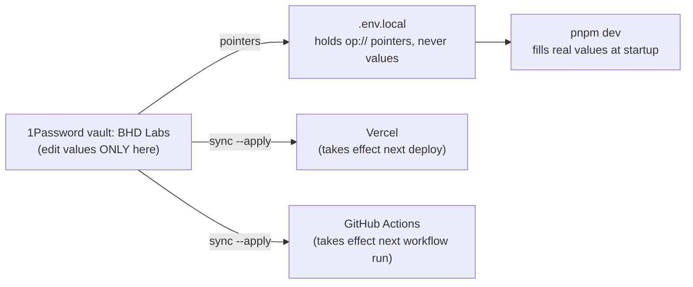

# Secrets runbook

## Rotating a credential — your five steps

1. **Create the new value at the vendor** — links in [Where you rotate](#where-you-rotate) below.
2. **Paste it into the matching item** in the 1Password **BHD Labs** vault.
3. **Push it out:** `bash scripts/sync-secrets.sh --apply` (run without `--apply` to preview first, or ask Claude).
4. **Verify** — ask Claude: *"verify the ⟨vendor⟩ credential."*
5. **Revoke the old one — always last.** Revoking early breaks CI and prod while
   local dev keeps working, the most confusing failure available. Vercel values
   take effect on the **next deploy**; GitHub values on the next workflow run.

## The mental model

**One master copy; everything else is derived from it and can be regenerated.**

- The vault is the only place a value is **edited**. Vercel and GitHub hold
  copies because they can't read the vault at runtime — but the next sync
  overwrites them, so editing those dashboards by hand is wasted work.
- `.env.local` contains no secrets, only pointers — printing it leaks nothing.
- This shape is why the five steps above never change, whatever the vendor.

What variable exists where: `.env.example` is the registry (names + provenance, no values).

### Why some non-secrets live in the vault

The vault holds the **master copy of production config**, which is a slightly
wider job than holding credentials. A value belongs here if losing it would cost
real work to recover — whether or not it is secret.

Two PDF viewer variables qualify and are neither secret:

| Variable | Why it is not a secret | Why it is vaulted anyway |
| --- | --- | --- |
| `PDF_GOOGLE_REDIRECT_URI` | a public URL, visible in the browser mid-handshake | Vercel stores it write-only, so it cannot be read back |
| `PDF_ALLOWED_GOOGLE_SUBS` | an opaque account id; it authenticates nobody | recovering it means failing a sign-in on purpose and reading the rejected claim from the runtime log |

The failure this prevents: on 2026-08-18 production returned
`{"error":"Google OAuth is not configured"}` because `PDF_GOOGLE_REDIRECT_URI`
had never been set. Four of the five variables that route needs were in the
manifest and synced; the fifth was plaintext config with no managed path, so
nothing pushed it and nothing noticed. Anything set only by hand in a dashboard
has no master copy and will go missing the same way.

## Where you rotate

| Vault item | You rotate at | Watch out |
| --- | --- | --- |
| OpenAI | [platform.openai.com/api-keys](https://platform.openai.com/api-keys) | keys live under the **project**, not "User API keys" |
| Stripe | [live keys](https://dashboard.stripe.com/apikeys) · [test keys](https://dashboard.stripe.com/test/apikeys) | rolls with a grace period. Webhook secrets are separate, under the **endpoint** |
| Supabase experiment-hub | [settings → API](https://supabase.com/dashboard/project/ulqdjuiffpazzixnwwso/settings/api) | confirm the project name — keys look identical across projects |
| Supabase simple-seed-organizer | [settings → API](https://supabase.com/dashboard/project/orlpgxqbesxvlhlkbnqy/settings/api) | same warning, other direction |
| Google OAuth pdf-metadata-viewer | [console credentials](https://console.cloud.google.com/apis/credentials) → `pdf-metadata-viewer web` | reset is an **instant kill**, no grace — push to Vercel in the same sitting |
| Notion | [integrations](https://www.notion.so/profile/integrations) → **BHD Portfolio** | needs Update/Insert **capabilities** + a connection to each database |
| Figma | [Settings → Security → PATs](https://www.figma.com/developers/api#access-tokens) | |
| GitHub | [fine-grained PATs](https://github.com/settings/tokens?type=beta) | prefer **editing** permissions (keeps the value) over regenerating |
| Etsy | [etsy.com/developers/your-apps](https://www.etsy.com/developers/your-apps) | |
| Vercel | [account → tokens](https://vercel.com/account/settings/tokens) | tokens are never re-viewable |
| PDF session | nowhere — mint any long random string | only invalidates live sessions |

Verification after a push is Claude's job — just ask **"verify the ⟨vendor⟩ credential."**

## Which Notion database is which

| Variable | Database | Drives |
| --- | --- | --- |
| `NOTION_EXPERIMENTS_DATA_SOURCE_ID` | BHD Labs Database | hub experiment list + detail pages (public site) |
| `NOTION_HISTORY_DATA_SOURCE_ID` | BHD Labs History | History band on detail pages (public site) |
| `NOTION_INVENTORY_DB_ID` | Etsy listings | `etsy-notion-sync.yml` only — not the website |

## Intentionally empty

`STRIPE_WEBHOOK_SECRET_TEST` — no test-mode webhook endpoint exists (live-only at
this scale). Sync refuses the `PASTE_VALUE_HERE` placeholder, so it can never be
pushed by accident. Create a test endpoint if ELK's webhook flow ever needs
end-to-end testing.

## If 1Password is unavailable

`pnpm dev` runs `scripts/op-preflight.sh` and fails pointing here. Readiness
check is `op vault list` (`op whoami` lies under app integration). Causes, in
order: app quit/locked → open it · integration toggle off → 1Password Settings →
Developer → *Integrate with 1Password CLI*, then ⌘Q and reopen · macOS denying
the calling app (op says "No accounts configured" with everything on) → run from
a terminal that has the grant, or System Settings → Privacy & Security.
Emergency bypass, per shell only: `export KEY="$(op read 'op://BHD Labs/<item>/<field>')"` —
never paste values back into `.env.local`.

---

## Agent notes

Reference for Claude; the human playbook ends above this line.

### Verification map

| Credential | Verified by |
| --- | --- |
| OpenAI | `experiments/simple-seed-organizer/prototype/app/tests/openai-connection.test.ts` |
| Stripe | ELK checkout |
| Supabase experiment-hub | prod page load |
| Supabase simple-seed-organizer | SSO live test in CI |
| Google OAuth | PDF viewer sign-in |
| Notion / Etsy | dispatch `etsy-notion-sync.yml` |
| GitHub dispatch token | hub "Sync now" button |
| Vercel | `deploy-hub.yml` |
| PDF session | PDF viewer sign-in |

### Gotchas, each learned the hard way

- **Deployed copies are write-only.** GitHub secrets can't be read back; Vercel
  Sensitive values read back as `[SENSITIVE]`. The vault is the only recoverable
  copy — sync overwriting a target destroys the old value forever.
- **Environment secrets hide.** `gh secret list` shows repo secrets only; add
  `--env "Production – experiment-hub"` (en-dash) for the rest.
- **Notion 403 `restricted_resource` on a write = missing capability, not a
  missing share.** Capabilities are per-integration. Identify any token with
  `GET /v1/users/me`; list what it sees with `POST /v1/search`.
- **Notion `*_DATA_SOURCE_ID`s are not the id in the Notion URL** — fetch data
  sources via `GET /v1/databases/<database_id>` (API version `2025-09-03`).
  `NOTION_INVENTORY_DB_ID` *is* a plain database id (the Python sync pins `2022-06-28`).
- **GitHub `Actions` permission ≠ `Secrets` permission.** `gh secret set` needs
  `Secrets: Read and write` on the PAT; repo admin is not sufficient.
- **Fine-grained PATs expire silently.** A GitHub call failing "for no reason" —
  check [expiry dates](https://github.com/settings/personal-access-tokens) first,
  and record the date on the 1Password item.
- **`op item create` writes epoch dates.** Set `valid from`/`expires` explicitly
  or 1Password badges the item as expired since 1969.
- **Sweep `~/Downloads` after any Google credential reset:**
  `grep -rlE "GOCSPX-|sk_live_|sk-proj-|ntn_|github_pat_|figd_|whsec_" ~/Downloads`
