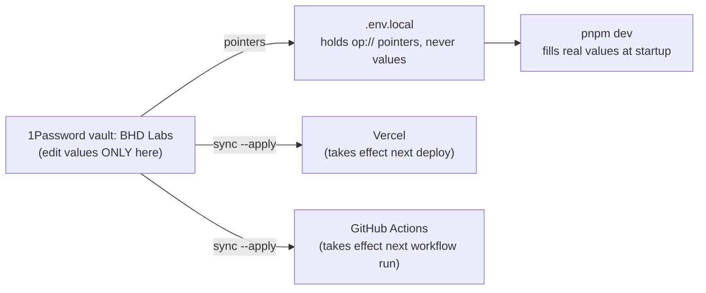

# Secrets runbook

## The mental model

**One master copy; everything else is derived from it and can be regenerated.**



- The vault is the only place a value is **edited**. Vercel and GitHub hold
  copies because they can't read the vault at runtime — but the next sync
  overwrites them, so editing those dashboards by hand is wasted work.
- `.env.local` contains no secrets, only pointers — printing it leaks nothing.
- Because of this shape, rotating **any** credential is always the same five
  steps, whatever the vendor:
  **create new at vendor → paste into the vault item → push → verify → revoke old.**

What variable exists where: `.env.example` is the registry (names + provenance, no values).

```bash
bash scripts/sync-secrets.sh          # preview what would change
bash scripts/sync-secrets.sh --apply  # push to Vercel + GitHub Actions
```

**Revoke LAST.** Revoking early breaks CI and prod while local dev keeps working —
the most confusing failure available. Vercel values only take effect on the
**next deploy**; GitHub values apply on the next workflow run.

## Where to rotate

| Vault item | Rotate at | Mode | Verify with |
| --- | --- | --- | --- |
| OpenAI | [platform.openai.com/api-keys](https://platform.openai.com/api-keys) — keys live under the **project**, not "User API keys" | create → revoke | `experiments/simple-seed-organizer/prototype/app/tests/openai-connection.test.ts` |
| Stripe | [live](https://dashboard.stripe.com/apikeys) · [test](https://dashboard.stripe.com/test/apikeys) — webhook secrets are under the **endpoint**, not the API keys page | roll, with grace period | ELK checkout |
| Supabase experiment-hub | [settings → API](https://supabase.com/dashboard/project/ulqdjuiffpazzixnwwso/settings/api) | create → revoke | prod page load |
| Supabase simple-seed-organizer | [settings → API](https://supabase.com/dashboard/project/orlpgxqbesxvlhlkbnqy/settings/api) | create → revoke | SSO live test in CI |
| Google OAuth pdf-metadata-viewer | [console credentials](https://console.cloud.google.com/apis/credentials) → `pdf-metadata-viewer web` | reset = **instant kill**, no grace — update Vercel same sitting | PDF viewer sign-in |
| Notion | [integrations](https://www.notion.so/profile/integrations) → **BHD Portfolio** | regenerate | `etsy-notion-sync.yml` dispatch |
| Figma | [figma.com → Settings → Security → PATs](https://www.figma.com/developers/api#access-tokens) | create → revoke | Figma MCP call |
| GitHub (dispatch + api tokens) | [fine-grained PATs](https://github.com/settings/tokens?type=beta) | create → revoke; prefer **editing** permissions (keeps value) over regenerate | hub "Sync now" button |
| Etsy | [etsy.com/developers/your-apps](https://www.etsy.com/developers/your-apps) | create → revoke | `etsy-notion-sync.yml` dispatch |
| Vercel | [account → tokens](https://vercel.com/account/settings/tokens) | create → revoke — tokens are never re-viewable | `deploy-hub.yml` |
| PDF session | nowhere — mint any long random string | rotate freely; only invalidates live sessions | PDF viewer sign-in |

## Rules that were each learned the hard way

- **Deployed copies are write-only.** GitHub secrets can't be read back; Vercel
  Sensitive values read back as `[SENSITIVE]`. The vault is the only recoverable
  copy — sync overwriting a target destroys the old value forever.
- **Environment secrets hide.** `gh secret list` shows repo secrets only; add
  `--env "Production – experiment-hub"` (en-dash) for the rest.
- **Keys look identical across Supabase projects.** Hub tables live in
  `ulqdjuiffpazzixnwwso`, SSO tables in `orlpgxqbesxvlhlkbnqy`. Confirm the
  project name before pasting anything.
- **Notion 403 `restricted_resource` on a write = missing capability, not a
  missing share.** Capabilities (Update/Insert content) are per-integration, in
  integration settings. Identify any token with `GET /v1/users/me`; list what it
  sees with `POST /v1/search`.
- **GitHub `Actions` permission ≠ `Secrets` permission.** `gh secret set` needs
  `Secrets: Read and write` on the PAT; repo admin is not sufficient.
- **Fine-grained PATs expire silently.** A GitHub call failing "for no reason" —
  check [expiry dates](https://github.com/settings/personal-access-tokens) first,
  and record the date on the 1Password item.
- **`op item create` writes epoch dates.** Set `valid from`/`expires` explicitly
  or 1Password badges the item as expired since 1969.
- **Sweep `~/Downloads` after any Google credential reset:**
  `grep -rlE "GOCSPX-|sk_live_|sk-proj-|ntn_|github_pat_|figd_|whsec_" ~/Downloads`

## Which Notion database is which

| Variable | Database | Drives |
| --- | --- | --- |
| `NOTION_EXPERIMENTS_DATA_SOURCE_ID` | BHD Labs Database | hub experiment list + detail pages (public site) |
| `NOTION_HISTORY_DATA_SOURCE_ID` | BHD Labs History | History band on detail pages (public site) |
| `NOTION_INVENTORY_DB_ID` | Etsy listings | `etsy-notion-sync.yml` only — not the website |

The two `*_DATA_SOURCE_ID`s are **not** the id in the Notion URL — fetch data
sources via `GET /v1/databases/<database_id>` (API version `2025-09-03`).
`NOTION_INVENTORY_DB_ID` *is* a plain database id (the Python sync pins `2022-06-28`).

## Intentionally empty

`STRIPE_WEBHOOK_SECRET_TEST` — no test-mode webhook endpoint exists (live-only at
this scale). Sync refuses the `PASTE_VALUE_HERE` placeholder, so it can never be
pushed by accident. Create a test endpoint if ELK's webhook flow ever needs
end-to-end testing.

## If 1Password is unavailable

`pnpm dev` runs `scripts/op-preflight.sh` and fails pointing here. Readiness
check is `op vault list` (`op whoami` lies under app integration). Causes, in
order: app quit/locked → open it · integration toggle off → 1Password Settings →
Developer → *Integrate with 1Password CLI*, then ⌘Q and reopen · macOS denying
the calling app (op says "No accounts configured" with everything on) → run from
a terminal that has the grant, or System Settings → Privacy & Security.
Emergency bypass, per shell only: `export KEY="$(op read 'op://BHD Labs/<item>/<field>')"` —
never paste values back into `.env.local`.
