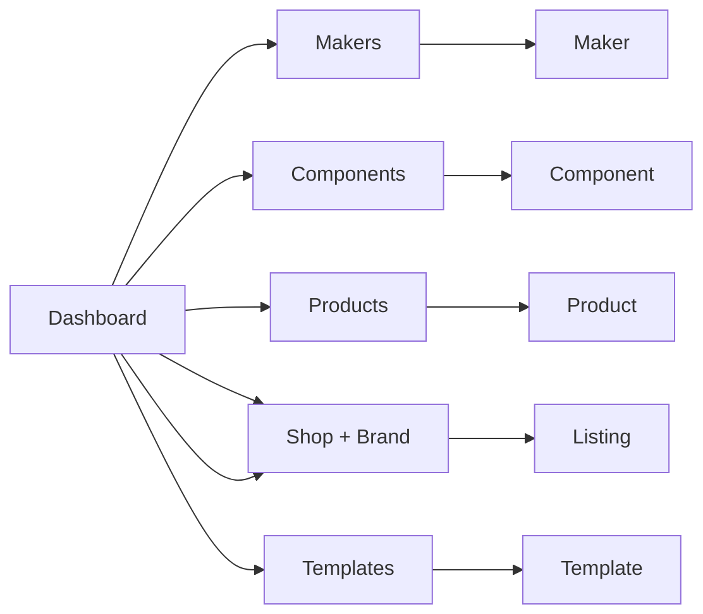

# Etsy Patternator - PRD

**Jump to:** [Sitemap](#sitemap) · [Core Flows + API (CRUD)](#core-flows)

## Overview

Etsy Patternator is a workflow automation tool for embroidery pattern creators. It generates optimized Etsy listings, product images (mockups, lay flats, lifestyle shots), and customer communications — all anchored to a defined store brand identity — so you spend time drawing patterns in Procreate, not formatting listings.

**Strategy**: Personal tool first (Year 1), SaaS productization second (Year 2–3). Don't build multi-user features until the personal tool proves real time savings.

---

## Problem Statement

Creating and managing Etsy listings for embroidery patterns is time-consuming and repetitive. Each listing requires:

- Writing SEO-optimized titles, descriptions, and 13 keyword tags
- Generating product images: mockups, lay flats, lifestyle shots, store assets
- Formatting downloadable files (printable pattern + instruction PDF)
- Writing customer communication: order confirmations, download instructions, FAQ responses

This takes 30–60 minutes per listing and 5–10 hours/week total. The goal is 10–15 minutes per listing and 2–3 hours/week — saving enough time to meaningfully redirect toward creative work.

---

## Goals & Objectives

1. Reduce per-listing creation time from 30–60 minutes to 10–15 minutes
2. Generate consistent, on-brand images for every listing without manual Canva work
3. Save 3–7 hours/week of operational time to redirect toward drawing patterns
4. Validate real time savings with a real Etsy store before any SaaS work begins

---

## Target User

Etsy sellers who make their own products and are design- and brand-driven.

---

## Core Features

### MVP scope

- **Brand identity**: Define store name, tone, and creative direction once. Everything generated — listings, images, customer messages — applies this automatically for consistency across the store.
- **Product planning**: Simple kanban/list to track pattern ideas from concept to listed. Status: idea → in-progress → ready → listed.
- **Listing authoring**: Generate title (140 chars, SEO-optimized), description (brand tone, keyword-rich), and 13 tags from a pattern name and basic details.
- **Image generation**: Import Procreate export as the seed file; generate store header, profile image, mockups, lay flats, and customer downloads (printable PDF + instruction PDF). Config file for Etsy size/resolution specs so spec changes don't require code changes.
- **Customer communications**: Generate order confirmation, download delivery message, follow-up with coupon, and sample responses to 5–10 common questions — all in the store's brand voice.
- **SEO validation**: Check keyword presence across title/description/tags; score and flag gaps.
- **Export**: Formatted text + organized image folders, ready to copy/paste into Etsy. No Etsy API integration.

**Out of scope for MVP**: Etsy API integration, multi-user/SaaS features, cloud sync, social media scheduling, advanced analytics, direct listing publishing.

---

## Success Metrics

- **Time per listing: < 15 minutes** — self-timed; down from 30–60 min
- **Sustained use: 10+ listings over 3 months** — the signal that it's worth productizing

---

## Sitemap

---

## Core Flows + API (CRUD)

Each row is **one user flow**. Only the CRUD column that matches the flow is checked. **Outcome** ties to our larger goals: reclaim time for drawing, keep output on-brand, and make **first-time creation** of every object feel fast and guided (not a bare form—we meet people with help and defaults).

<table>
    <thead>
      <tr>
        <th>Domain</th>
        <th>Flow</th>
        <th>Outcome</th>
        <th>C</th>
        <th>R</th>
        <th>U</th>
        <th>D</th>
      </tr>
    </thead>
    <tbody>
      <tr>
        <td>Dashboard</td>
        <td>Open dashboard (first visit)</td>
        <td>Orientation: a clear “what to do first” and a path to a credible first brand + first listing in one session—feels like guidance, not a blank app.</td>
        <td>☐</td>
        <td>✅</td>
        <td>☐</td>
        <td>☐</td>
      </tr>
      <tr>
        <td>Dashboard</td>
        <td>Open dashboard (100th visit)</td>
        <td>Habitual home: at-a-glance status of drafts, in-progress patterns, and what’s live so the next action is obvious—seconds of scanning, not admin scavenger hunt. Aligns with sustained use (e.g. 10+ listings / quarter).</td>
        <td>☐</td>
        <td>✅</td>
        <td>☐</td>
        <td>☐</td>
      </tr>
      <tr>
        <td>Brand</td>
        <td>Create new brand</td>
        <td>A defined store voice and visuals exist so every generated listing, image brief, and message stays on-brand—first run is quick and supported (defaults, naming help), not a cold form.</td>
        <td>✅</td>
        <td>☐</td>
        <td>☐</td>
        <td>☐</td>
      </tr>
      <tr>
        <td>Brand</td>
        <td>View all brands</td>
        <td>Scan and compare brands with minimal friction—supports a clear mental model when you run more than one store or experiment with identity.</td>
        <td>☐</td>
        <td>✅</td>
        <td>☐</td>
        <td>☐</td>
      </tr>
      <tr>
        <td>Brand</td>
        <td>View brand details</td>
        <td>Enough context to trust tone and direction before generating copy or customer comms—less rework and off-brand surprises.</td>
        <td>☐</td>
        <td>✅</td>
        <td>☐</td>
        <td>☐</td>
      </tr>
      <tr>
        <td>Brand</td>
        <td>Edit brand details</td>
        <td>Brand evolves without re-building every listing from scratch; future generation and assets pick up the new voice and visuals.</td>
        <td>☐</td>
        <td>☐</td>
        <td>✅</td>
        <td>☐</td>
      </tr>
      <tr>
        <td>Pattern</td>
        <td>Add pattern</td>
        <td>A pattern is in your inventory from Procreate/art in minutes—first add feels guided (upload, naming, what happens next), not a bare upload box.</td>
        <td>✅</td>
        <td>☐</td>
        <td>☐</td>
        <td>☐</td>
      </tr>
      <tr>
        <td>Pattern</td>
        <td>List patterns</td>
        <td>See what’s in flight vs ready to list in one pass—less ops overhead, more time in Procreate (hours/week back).</td>
        <td>☐</td>
        <td>✅</td>
        <td>☐</td>
        <td>☐</td>
      </tr>
      <tr>
        <td>Pattern</td>
        <td>View pattern</td>
        <td>One source of truth before edit or “make listing”—avoids duplicating work and keeps per-listing time on track (10–15 min goal).</td>
        <td>☐</td>
        <td>✅</td>
        <td>☐</td>
        <td>☐</td>
      </tr>
      <tr>
        <td>Pattern</td>
        <td>Edit existing pattern</td>
        <td>Edits are explicit and safe—listings and exports stay coherent with the pattern the buyer gets, without mystery DB drift.</td>
        <td>☐</td>
        <td>☐</td>
        <td>✅</td>
        <td>☐</td>
      </tr>
      <tr>
        <td>Pattern</td>
        <td>Delete pattern</td>
        <td>Inventory matches reality: no ghost patterns or orphan references—keeps the shop and listing pipeline trustworthy.</td>
        <td>☐</td>
        <td>☐</td>
        <td>☐</td>
        <td>✅</td>
      </tr>
      <tr>
        <td>Template</td>
        <td>Add template</td>
        <td>A reusable product shell (SEO, structure, image slots) is ready so first listing of that product type is fast, guided, and on-brand every time.</td>
        <td>✅</td>
        <td>☐</td>
        <td>☐</td>
        <td>☐</td>
      </tr>
      <tr>
        <td>Template</td>
        <td>List templates</td>
        <td>Choose the right template without hunting—cuts minutes off each listing, toward the 10–15 min per listing goal.</td>
        <td>☐</td>
        <td>✅</td>
        <td>☐</td>
        <td>☐</td>
      </tr>
      <tr>
        <td>Template</td>
        <td>View template</td>
        <td>Review fields, art, and links in one place before that template drives another listing—fewer “oops” listing generations.</td>
        <td>☐</td>
        <td>✅</td>
        <td>☐</td>
        <td>☐</td>
      </tr>
      <tr>
        <td>Template</td>
        <td>Edit existing template</td>
        <td>Improving the template lifts the next N listings—leverages automation instead of retyping the same structure.</td>
        <td>☐</td>
        <td>☐</td>
        <td>✅</td>
        <td>☐</td>
      </tr>
      <tr>
        <td>Template</td>
        <td>Delete template</td>
        <td>New drafts don’t pick up retired shells; store stays intentional as your product line changes.</td>
        <td>☐</td>
        <td>☐</td>
        <td>☐</td>
        <td>✅</td>
      </tr>
      <tr>
        <td>Listing</td>
        <td>Generate draft (template + pattern(s))</td>
        <td>A draft listing exists with on-brand title, description, and tags in one shot—replacing the 30–60 min grind with a path that targets 10–15 min to copy-ready.</td>
        <td>✅</td>
        <td>☐</td>
        <td>☐</td>
        <td>☐</td>
      </tr>
      <tr>
        <td>Listing</td>
        <td>List listings</td>
        <td>Pipeline visibility for what’s drafted vs ready to paste into Etsy—supports sustained use and fewer “where did that draft go?” moments.</td>
        <td>☐</td>
        <td>✅</td>
        <td>☐</td>
        <td>☐</td>
      </tr>
      <tr>
        <td>Listing</td>
        <td>View listing</td>
        <td>Full draft in one place for review and export to Etsy—confidence before you paste or ship assets.</td>
        <td>☐</td>
        <td>✅</td>
        <td>☐</td>
        <td>☐</td>
      </tr>
      <tr>
        <td>Listing</td>
        <td>Edit existing listing</td>
        <td>Iterating copy or tags stays inside the workflow so you don’t restart the clock—keeps total handling time within the per-listing budget.</td>
        <td>☐</td>
        <td>☐</td>
        <td>✅</td>
        <td>☐</td>
      </tr>
      <tr>
        <td>Listing</td>
        <td>Delete listing</td>
        <td>Work-in-progress matches what you’re actually selling—cleaner headspace and less operational debt.</td>
        <td>☐</td>
        <td>☐</td>
        <td>☐</td>
        <td>✅</td>
      </tr>
      <tr>
        <td>Shop copy</td>
        <td>Shop intro boilerplate (derived)</td>
        <td>Shop About copy in a consistent brand voice, ready to paste—less one-off writing, more time on patterns and products.</td>
        <td>✅</td>
        <td>✅</td>
        <td>✅</td>
        <td>☐</td>
      </tr>
    </tbody>
</table>
