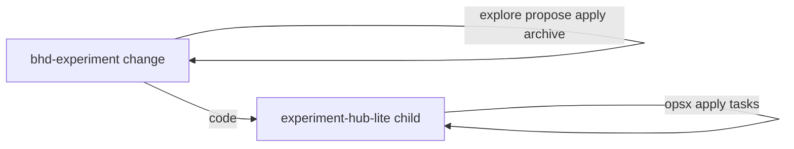

# OpenSpec in Experiment Hub

This directory holds **living capability specs** (`specs/`) and a **history of completed changes** (`changes/archive/`). It complements lean experiment PRDs under `experiments/*/docs/PRD.md`: use PRDs for experiment narrative; use OpenSpec for durable hub platform behavior and reviewable requirement deltas.

**CLI:** `npx @fission-ai/openspec@latest` (or install globally). Cursor / Claude: `/opsx:propose`, `/opsx:apply`, `/opsx:archive`, `/opsx:explore` — slash commands are **thin stubs** only; the workflow lives in [`skills/openspec-*.md`](../skills/) (one file per command).

**After clone:** `bash scripts/link-agent-dirs.sh` — symlinks `.cursor/rules`, `.cursor/skills`, `.claude/skills` to root `rules/` and `skills/`.

**Project config:** [`config.yaml`](config.yaml) sets the default workflow schema (**`experiment-hub-lite`** — intent-first spikes: Human anchor, Outcomes, hub skill voices per artifact). Per-change override: `openspec/changes/<name>/.openspec.yaml` → `schema: …`.

| Schema                              | Use when                                                              |
| ----------------------------------- | --------------------------------------------------------------------- |
| **`experiment-hub-lite`** (default) | New experiment spikes, prototypes under `experiments/`                |
| **`bhd-experiment`**                | Product lifecycle: explore → propose → apply → archive (Build Units)  |
| **`experiment-hub`**                | Sponsor-backed ladder (Evidence / Proceed), platform cross-cutting    |
| **`quickstart`**                    | Vanilla / upstream comparison (`spec-driven` alias may still resolve) |

**Dual track (BHD + lite):** Parent change `schema: bhd-experiment` holds `explore.md` … `archive.md`. Child change `schema: experiment-hub-lite` (e.g. `<slug>-build`) ships code; `/opsx:apply` on the **child** only.

**Local schemas:** [`schemas/experiment-hub-lite/`](schemas/experiment-hub-lite/) (default) · [`schemas/bhd-experiment/`](schemas/bhd-experiment/) · [`schemas/experiment-hub/`](schemas/experiment-hub/) (full ladder — reference / sponsor) · [`schemas/quickstart/`](schemas/quickstart/)

**BHD vs lite slash commands** (same commands, different artifacts):

| Command         | Lite / full                            | `bhd-experiment`                                                   |
| --------------- | -------------------------------------- | ------------------------------------------------------------------ |
| `/opsx:explore` | Freeform thinking                      | Still freeform; structured Explore = `/opsx:propose` on BHD change |
| `/opsx:propose` | `proposal.md` → specs → design → tasks | `explore.md` → `propose.md` → `apply.md` → `archive.md`            |
| `/opsx:apply`   | Implement `tasks.md`                   | Child lite change for code, or edit Build Units in `apply.md`      |
| `/opsx:archive` | Move change folder to archive          | Complete `archive.md`, then folder archive                         |

**Workflow:** See [`rules/openspec-workflow.mdc`](../rules/openspec-workflow.mdc).

**Artifacts in chat:** Every `/opsx:*` turn that writes under `openspec/changes/` must end with a `## Artifacts` block—clickable repo-relative markdown links derived from CLI JSON (`outputPath`, `contextFiles`, `openspec status --json`), not hardcoded filenames. See [`skills/openspec-artifacts-output.md`](../skills/openspec-artifacts-output.md).
