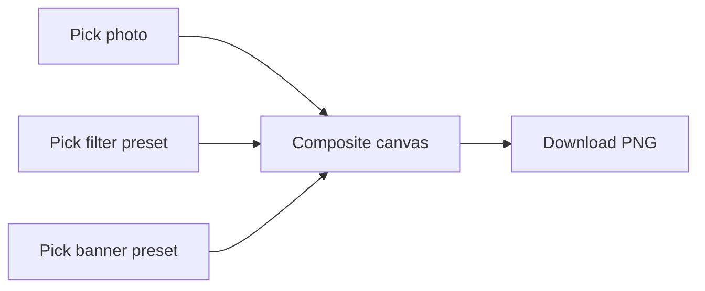

## Context

Anchors `proposal.md` for a super-simple canvas-based photo tooling spike inside the Experiment Hub mono-repo (`photo-filters-banner-download`).

## Goals / Non-Goals

**Goals:**

- Single-page SPA feel with **immediate preview** driven by Canvas 2D.
- MVP filter bank (brightness/contrast plus at least two tonal presets) plus two banner/frame overlays selectable from thumbnails.
- **Download** emits **PNG** bytes client-side (≤2s target on laptop-class hardware for ≤2048 px longest-edge guidance copy in UI).
- Package via **Next.js App Router** experiment prototype conventions so Turbo / `pnpm dev` mirrors other experiments.

**Non-Goals:**

- Account system, uploads to cloud, PSD-level timelines, RAW processing, trusting arbitrary visitor-supplied SVG (repo-authored SVG overlays are acceptable).

## User flow / IA (optional)

Skeleton layout: stacked mobile, split desktop _(preview right / controls left)_.

## Visual design / Figma

**Primary file:** [Prototype — photo-filters-banner-studio](https://www.figma.com/design/kgPYePkPOC4Sg0VdVEvfYh/Prototype--photo-filters-banner-studio?node-id=0-1) (`kgPYePkPOC4Sg0VdVEvfYh`, node `0:1`)

- **Libraries:** BHD Labs / shadcn (components + **mode** color tokens, **tw/gap** / **tw/padding**, **radius-\***, text styles).
- **Status:** scaffolded + tokenized + breakpoint-sized (2026-05-16) — **L · lg · 1024px** (`13:99`) / **S · 480px** (`13:160`) on Scratch. **Dark mode** explicit on both frames. **Content Types** spec chips (`29:106` L, `29:109` S) from BHD Labs annotate each frame.
- **Page breakpoints (BHD Labs `Content Types` + hub `design-guidelines.mdc`):**

  | Frame   | BHD spec       | Tailwind / token          | Width  | Page padding             |
  | ------- | -------------- | ------------------------- | ------ | ------------------------ |
  | Desktop | `Property 1=L` | `lg:` · `max-w-screen-lg` | 1024px | `px-16` + `p-8` vertical |
  | Mobile  | `Property 1=S` | base (mobile)             | 480px  | `px-4` + `p-4`           |

- **Token bindings (shadcn):** `background` (page) · `card` + `border` + `radius-lg` + `p-6` (preview) · `muted` + `border` + `radius-md` (canvas) · `gap-8` (desktop) / `gap-4` (mobile) · text: `Text-2xl/Semi Bold` + `foreground`, `Text-sm/Regular` + `muted-foreground`, `Text-xs/Semi Bold` section labels, `Text-xs/Regular` hints. Button instances inherit library component styles. Desktop frame width bound to **`max-w-screen-lg`**.
- **Code:** align implemented UI to Hub dark tokens (`.cursor/rules/design-guidelines.mdc`) and reuse shadcn patterns where the library maps cleanly to React components in the prototype package.

## Decisions

- **Rendering**: `HTMLCanvasElement` 2D context for MVP stable path across browsers.
- **Image decode**: `createImageBitmap` when available with `Image()` fallback hooked to `decode()`.
- **Export**: `canvas.toBlob('image/png')` triggered from one Download button; revoke object URLs immediately after initiating download.
- **Placement**: new workspace under `experiments/photo-filters-banner/prototype/` with localized README + Turbo package entry wiring.
- **Testing**: prioritize Playwright happy-path plus optional deterministic canvas pixel assertions in Vitest helpers.

## Risks / Trade-offs

Very large uploads may hitch the UI — mitigate with spinner + longest-edge cap warning (>4096) before decoding.
