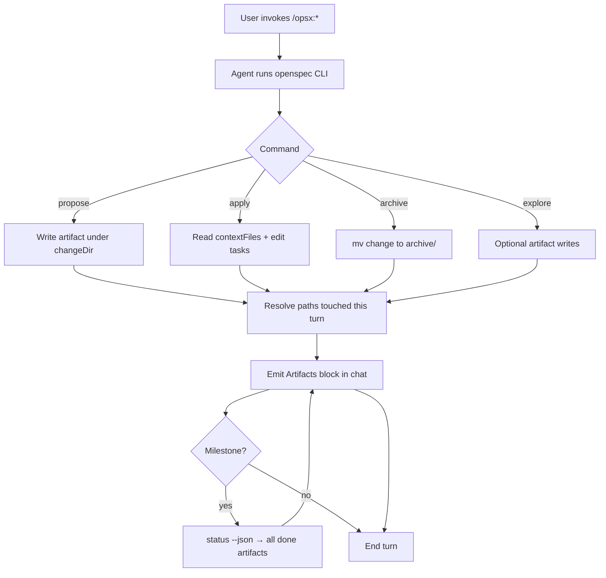

## Context

Hub OpenSpec runs entirely in Cursor agent chat—no product UI. Founders review `proposal.md`, specs, `design.md`, and `tasks.md` between lite approval gates. Agents already call `openspec status --json` and `openspec instructions … --json`; apply mode additionally exposes resolved absolute paths in `contextFiles`. The gap is **consistent presentation** of those paths as clickable markdown at the end of every opsx turn.

## Goals / Non-Goals

**Goals:**

- Every opsx command ends with a predictable **Artifacts** block the user can scan and click.
- Path resolution is **schema-agnostic** (lite, full hub, quickstart) via CLI JSON, not filename cheat sheets.
- One documented formatter convention shared across `.cursor/commands/`, `skills/`, and Claude mirrors.

**Non-Goals:**

- Figma, breakpoints, or visual design (N/A).
- Forking or patching `@fission-ai/openspec` upstream.
- IDE extensions, web dashboards, or auto-opening files without user click.

## User flow / IA



**Information architecture (chat message footer):**

```markdown
## Artifacts

- [proposal.md](openspec/changes/<name>/proposal.md)
- [spec.md](openspec/changes/<name>/specs/openspec-workflow-artifact-links/spec.md)
```

- Section title is always `## Artifacts` (H2) so it is easy to spot when scrolling.
- One bullet per file; label = basename, target = repo-relative path from workspace root.
- **Per-turn:** only files created or updated in the current agent response.
- **Milestone:** when all `applyRequires` artifacts are `done` or all tasks complete, list every artifact file for the change (re-run `openspec status --change <name> --json`).

## Visual design / Figma

| Item             | Value                                      |
| ---------------- | ------------------------------------------ |
| Primary file URL | N/A — no UI; agent chat markdown only      |
| Frames in scope  | N/A                                        |
| Libraries        | N/A                                        |
| Breakpoints      | N/A                                        |
| Status           | Workflow/docs change; Figma not applicable |

## Decisions

### 1. Repo-relative markdown links (not bare paths)

**Choice:** `[basename](openspec/changes/<name>/…)` from workspace root.

**Why:** Cursor renders these as one-click navigation; matches existing hub doc link style. Absolute paths from `contextFiles` work but are noisy in git diffs and copy-paste; agents SHOULD normalize to repo-relative when emitting **Artifacts**.

### 2. Path resolution rules (single algorithm)

| Source                                               | Resolution                                                                                               |
| ---------------------------------------------------- | -------------------------------------------------------------------------------------------------------- |
| `openspec instructions <id> --json` after a write    | `changeDir` + `outputPath`; if `outputPath` contains `**`, glob under `changeDir` (e.g. `specs/**/*.md`) |
| `openspec instructions apply --json`                 | Union of all paths in `contextFiles`; plus any task file path the agent edited this session              |
| `openspec status --change <name> --json` (milestone) | For each artifact with `status: "done"`, apply row above; dedupe                                         |
| Archive                                              | After `mv`, link `openspec/changes/archive/YYYY-MM-DD-<name>/` (directory link is acceptable)            |

**Why:** Same algorithm for every schema; only JSON shape differs.

### 3. Central convention in skills, referenced by commands

**Choice:** Add a short **Artifacts output** subsection to each `skills/openspec-*.md` (canonical). `.cursor/commands/opsx-*.md` and `.claude/*` mirrors point to the same rules with “MUST emit ## Artifacts …” to avoid drift.

**Alternative rejected:** Only updating commands—skills are what Claude hook sync copies.

### 4. Optional helper script (defer unless apply tasks need it)

**Choice:** Implement `scripts/openspec-artifact-links.mjs` only if duplicating glob logic across four skills proves error-prone during apply.

**Behavior if added:** `node scripts/openspec-artifact-links.mjs --change <name> [--turn <paths>…]` prints the **Artifacts** markdown block to stdout; agents paste verbatim.

### 5. Explore mode: links only when files change

**Choice:** `/opsx:explore` is read-mostly; emit **Artifacts** only when explore creates or updates files under `openspec/changes/` (per spec).

**Why:** Avoids noise on pure thinking turns.

## Risks / Trade-offs

| Risk                                          | Mitigation                                                                                        |
| --------------------------------------------- | ------------------------------------------------------------------------------------------------- |
| Agents skip **Artifacts** under time pressure | Mandatory section in command front-matter; tasks §1 includes manual “smoke” checkbox per scenario |
| `specs/**/*.md` glob missed                   | Explicit instruction to glob `changeDir`; optional script                                         |
| Duplicate links on milestone + per-turn       | Milestone block replaces per-turn list or dedupes by path                                         |
| Claude vs Cursor skill drift                  | Edit `skills/` first; run existing hook sync to `.claude/skills/`                                 |
