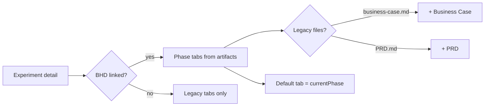

# Design — hub-bhd-schema-tabs

## Context

[`openspec-hub-experiment-link`](../openspec-hub-experiment-link/) ships `openSpecLifecycle` on the experiment detail page and a combined **Lifecycle** tab plus always-visible **Business Case** / **PRD**. Pomodoro Maker illustrates the gap: Explore content lives in `openspec/changes/pomodoro-maker/explore.md`, but the UI defaults to an empty Business Case tab.

This change aligns the detail **tab strip** with `bhd-experiment` phase artifacts and hides tabs when files are absent — no new routes or data loaders.

## Goals / Non-Goals

**Goals:**

- Build visible tabs from server-loaded `openSpecLifecycle.artifacts` (phase id + label via `formatBhdPhaseLabel`)
- Default `activeTab` to `currentPhase`; fallback to first phase in order explore → propose → apply → archive
- Append legacy **Business Case** / **PRD** only when `businessCaseContent` / `prdRawContent` are non-empty (trim check)
- One tab panel: phase header + optional "Current phase" chip + `MarkdownContent` (`variant="light"`)
- Remove stacked multi-phase Lifecycle layout in `tabs-content.tsx`

**Non-Goals:**

- Figma or hero redesign; tab chrome unchanged (51px height, active green underline)
- In-browser edit for BHD phase files; scorecards inside PRD tab unchanged
- Changing home list phase chip or `loadOpenSpecLifecycle` resolution

## User flow / IA

**Tab order (left → right):** Explore · Propose · Apply · Archive · Business Case · PRD (each segment omitted when empty).

**Reference:** Pomodoro Maker → single **Explore** tab, active on load; hero badge remains `BHD · Explore`.

## Visual design / Figma

| Item         | Value                                                                       |
| ------------ | --------------------------------------------------------------------------- |
| Figma URL    | N/A — reuse existing experiment detail tab pattern                          |
| Libraries    | Hub tokens per `design-guidelines.mdc` (dark hero, light body)              |
| Frames       | Match current `/experiments/[slug]` hero tabs + light `main` content        |
| Breakpoints  | `px-4 md:px-8 lg:px-16`; horizontal scroll on narrow viewports if many tabs |
| Code Connect | None                                                                        |

**Phase panel (in-tab):**

- Optional top rule: change path `openspec/changes/{changeId}/` · schema (muted, same as today Lifecycle intro)
- Phase title row: `bg-[#194b31]` bar with phase label; "Current phase" right-aligned when `tab.id === currentPhase`
- Body: `prose prose-sm max-w-none` + `MarkdownContent` — tables, lists, headings from `explore.md` etc.

## Decisions

- **Tab ids:** Use BHD phase ids (`explore`, `propose`, `apply`, `archive`) as `activeTab` values; legacy ids stay `business-case` and `prd`.
- **Tab builder:** Shared helper in `lib/openspec-shared.ts` (e.g. `buildExperimentDetailTabs({ openSpecLifecycle, businessCaseContent, prdRawContent })`) so `detail-client` and tests share one ordering/hide rule.
- **Initial state:** `useState(defaultTabId)` where `defaultTabId` is `currentPhase` if that phase is in the artifact list, else first phase tab, else first legacy tab with content, else `explore` (unreachable if no tabs — guard with empty state copy in main).
- **Lifecycle removal:** Delete `activeTab === "lifecycle"` branch; map `activeTab` to `artifacts.find(a => a.phase === activeTab)`.
- **Empty experiment:** If no tabs after build, show one-line message in main (no tab buttons) — edge case for registered experiment with no docs and no OpenSpec.

## Risks / Trade-offs

- **[Many tabs on wide experiments]** → horizontal scroll on tab row; no dropdown in v1.
- **[Users expect Business Case tab]** → content belongs in Propose artifact; legacy file still gets a tab when present.
- **[Large explore.md]** → same as today; no TOC in v1.
