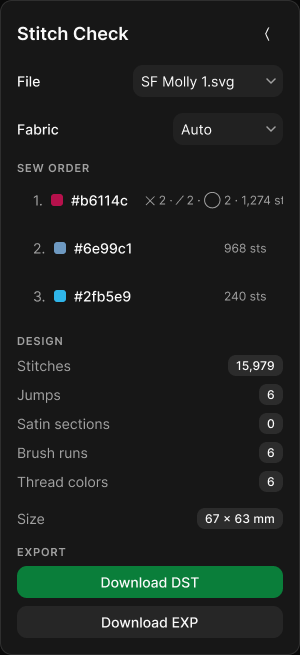
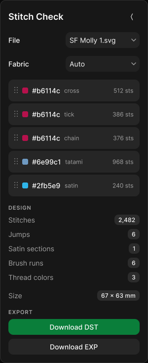
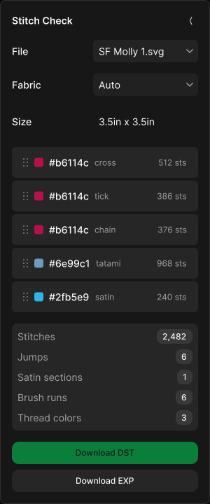

# Design: retire-umbrella-switches

## Context

The converter panel grew three all-or-nothing stitch switches before the
`st-` tag vocabulary existed. Each applies one decision to every shape in
the file, so a global switch and a per-shape declaration can disagree —
and until PR #485 the switch won silently. This change removes the
switches and lets the design file speak for itself.

The surface is `app/svg-to-stitch/page.tsx`: a 300 px panel floating over
a full-viewport canvas, rendered in `.mvds-theme` — MVDS 0.3.0's own dark
palette, deliberately not the hub skin (`app/svg-to-stitch/layout.tsx`).

## Goals / Non-Goals

**Goals:**

- Remove every control that changes stitch type for more than the shape
  it names.
- Keep the panel's remaining job intact: what am I making (size,
  fabric), what will it sew (sew order, stats), and getting the file out.
- Leave untagged output byte-identical to today.

**Non-Goals:**

- Building the per-colour-block angle / stitch / density controls the
  founder wants in the sew-order list. That is the next change; this one
  clears the surface that would contradict it.
- Touching **Fabric** (preview backdrop) or **Design size** (a
  per-conversion choice the authoring contract keeps in the panel).

## User flow / IA

Unchanged in shape, shorter in practice. The panel reads top to bottom:
file → design size → fabric → sew order → design stats → export. Removing
the switch cluster and the two fill selects takes the panel from 968 px
to 728 px tall. The three switch rows sit above **SEW ORDER**, so it
lifts 144 px — the part a stitcher actually reads before sewing moves up
by roughly its own height.

Nothing moves, nothing is renamed, nothing changes place. Five rows leave.

The logic behind the panel simplifies in the same direction — see the
decision flow in `proposal.md`, committed at
Figma page `03 Decision flow` (node `13:9`), committed at `assets/decision-flow.png`.

## Visual design / Figma

| Item                | Value                                                                                                                                                                                                                                             |
| ------------------- | ------------------------------------------------------------------------------------------------------------------------------------------------------------------------------------------------------------------------------------------------- |
| Primary file URL    | <https://www.figma.com/design/hHAppz4A23qMoLQFTo8QAc> ("svg-to-stitch — retire-umbrella-switches")                                                                                                                                                |
| As-is frame(s)      | `01 Current state` → `Current state · Desktop 1024` (node `8:123`), panel `8:12` — the shipped panel rebuilt from geometry measured off the running page, not from reading the JSX                                                                |
| Proposed frame(s)   | `02.1 Proposed — rebuilt from measured production` → `Proposed v2 · Desktop 1024` (node `8:131`), panel `8:132` — cloned from the as-is so the only difference is the five removed rows                                                           |
| Libraries / version | **MVDS Core** (library key in `rules/figma.mdc`) — `Badge` and `Switch` imported by key, the same two instances the `stitch-brushes` panel used. MVDS's `Tokens` collection is pinned to its **Dark** mode on each panel, matching `.mvds-theme`  |
| Local variables     | `hub tokens` collection on `00 Components` — 11 colours converted from the oklch declarations in `app/globals.css`; panel and text fills are bound to them rather than hardcoded                                                                  |
| Code Connect        | No mappings to update — no component is added, changed or renamed                                                                                                                                                                                 |
| Breakpoints         | S · 480px / L · 1024px. One frame per state is sufficient: the panel is `width: 300; maxWidth: calc(100vw - 24px)`, so at 480px it is still 300px wide and renders identically. Only below 324px would it clamp, which is off the supported range |
| Status              | **Approved 2026-09-17** — founder: "figma is approved". Round `03.6` is the approved surface; earlier rounds stay for comparison and are not edited                                                                                               |

**File convention** (per `rules/figma.mdc`): numbered pages, and each
later proposal iteration becomes a **new** page — `02.1 Proposed — <what
changed>` — never an edit to an existing one.

**Iterations on this change:**

| Page                                                           | Round      | What it holds                                                                                                                                                                                                                                                    |
| -------------------------------------------------------------- | ---------- | ---------------------------------------------------------------------------------------------------------------------------------------------------------------------------------------------------------------------------------------------------------------- |
| `02 Proposed`                                                  | v1         | The first proposal, built by reading the JSX — wrong on composition (rows that wrap, chevrons, stacked export buttons)                                                                                                                                           |
| `02.1 Proposed — rebuilt from measured production`             | v2         | The same removals, drawn from geometry measured off the running app                                                                                                                                                                                              |
| `03.1 Proposed — size declared in the document`                | v3         | Also removes **Design size**, after the founder settled that the document declares physical size (`st-size`, mm ×10). Numbering continues past `03`, which holds the decision-flow diagram                                                                       |
| `03.2 Proposed — file row on the input pattern, brand buttons` | v4, latest | Founder edits to the file picker carried forward: the filename reads as an input and **Replace** as a button, both on the label-and-control pattern the other rows use. The primary button treatment adopts the brand green, captured as a `brand-primary` token |
| `03.3 Proposed — one row pattern, matched control widths`      | v5         | File collapses to a single row and **Replace** is widened to the select's 110 px. Superseded within the same review                                                                                                                                              |
| `03.4 Proposed — file as a select, one row pattern throughout` | v6, latest | The file row becomes a select, so every key/value row is the same object. Founder: "what if file is also a dropdown? so that the key values are expressed in similar pattern and thus their spacing is consistent"                                               |
| `03.5 Proposed — sew order rows are reorderable stitch layers` | v7, latest | Founder edits carried forward (rows as filled cards, heading and index numbers gone) and the sew order split so each colour-and-stitch pair is its own reorderable row                                                                                           |
| `03.6 Proposed — rebuilt on MVDS components and tokens`        | v8, latest | Same composition, sourced properly: MVDS `Button` instances replace the hand-built ones, and 45 spacing, radius and type values are bound to MVDS variables instead of literals                                                                                  |

The convention was briefly broken: when v1 was rejected, its page was
cleared and rebuilt in place instead of a new page being added. That is
corrected — `02` and `02.1` both exist and can be compared — but page
`02` is a faithful reconstruction of the first round from its original
build script, not the untouched original frames. Later rounds go on
`02.2`, `02.3`, each a new page.

### Fidelity check

The first as-is frame was rejected by the founder — "this figma doesn't
match the current ui — especially the key value pairs with dropdowns or
toggles". It had been built by reading the JSX, which got the
composition wrong. The rebuild measures the running page instead:
element boxes, font sizes, radii and computed colours pulled off
`labs.beckharrisdesign.com/svg-to-stitch`, then reproduced.

What reading the code missed, and measuring caught:

| Element             | Assumed                      | Actual                                                          |
| ------------------- | ---------------------------- | --------------------------------------------------------------- |
| **Design size** row | label left, control right    | **wraps** — label on its own line, 199 px select beneath        |
| Select trigger      | small pill, no affordance    | 32 px tall, radius 10, white @ 4.5%, **chevron** right          |
| Sew-order rows      | text rows                    | full-width 44 px buttons, radius 10, 16 px side padding         |
| Export buttons      | side by side, both secondary | **full width, stacked**; DST the light primary, EXP secondary   |
| Labels              | 13 px regular                | 14 px medium (`Label`); stats 14 px regular (`CardDescription`) |
| Stat badges         | solid fill                   | neutral at **15%** alpha                                        |

`SelectRow` is `Inline … wrap`, so whether a row wraps depends on whether
its label and control fit in 266 px — which is why **Design size** wraps
and **Fabric** does not. That is emergent behaviour that reading the
component could not have revealed.

The imported MVDS `Badge` and `Switch` also resolved the library's
**Light** mode on import — the switch rendered a dark track where
production renders a light one. Both panels now pin `Tokens` to **Dark**:
file badge `#262626` on `#fafafa`, checked switch `#e5e5e5` track with a
`#0a0a0a` knob, matching the measured values.

The clipped composition on sew-order row 1 is **not** a drawing error —
production clips it the same way (`whiteSpace: nowrap`, no horizontal
scroll). The frame reproduces the bug rather than quietly fixing it.

## Decisions

1. **The proposed frame is a clone, not a rebuild.** A reviewer should
   be able to flip between the two pages and see only absence. Rebuilding
   invites incidental differences that read as proposals.
2. **Fill angle / density are hidden, not deleted.** The converter keeps
   both options at 45° and 0.4 mm and `a`/`d` tags still override them
   per shape, so the change is reversible and output is untouched.
3. **One breakpoint frame per state.** Stated above: the panel is
   width-fixed across the supported range, so a 480px frame would be a
   duplicate, not a second design.
4. **No new components.** Everything in the proposed frame already
   exists; the change is subtraction.
5. **The tag vocabulary is a cascade.** The founder's framing, and the
   model the rest of this change should be read against: "as someone who
   understands cascading and inheritance, I want this to feel like a
   similar system." Concretely, `st-` tags map onto CSS like this —

   | CSS              | Here                                               | State                                                                                                                                    |
   | ---------------- | -------------------------------------------------- | ---------------------------------------------------------------------------------------------------------------------------------------- |
   | Inheritance      | a tag on a group applies to its descendants        | works today                                                                                                                              |
   | Override         | a child restating a tag replaces the inherited one | works today                                                                                                                              |
   | **Extend**       | a child changing one parameter keeps the rest      | **missing** — `ownDirective` returns `null` without a type token, so a child tagged only `d8` is discarded and inherits the parent whole |
   | Containing block | the outer `st-size` bounds a nested one            | specified in `document-declared-size`                                                                                                    |
   | Initial value    | the documented untagged fallback                   | specified in `untagged-fallback`                                                                                                         |

   Two of the five already hold, two are specified by this change, and
   the missing one — per-property extend — is the piece that would change
   how every existing tag resolves.

   The spelling stays utility-class shaped (`st-satin w20`, a token plus
   terse modifiers, per the founder's earlier Tailwind reading); the
   _resolution_ is the cascade. Those are different axes and both are
   intended.

6. **Extend ships separately.** Per-property merging across `a`, `d`,
   `w`, `l` and `p` touches every directive and needs its own tests, and
   the lite schema caps a change at two new capabilities — this one
   already has both. Naming the model here means the follow-on change
   implements a stated principle rather than reopening the argument.

### Latest round — `03.4`

`03.2` was rejected as choppy, and measuring said why: three different
left edges for text and two controls of different widths sitting in
adjacent rows.

|                                 | Left edge | Width   |
| ------------------------------- | --------- | ------- |
| `File`, `Fabric`, `SEW ORDER`   | 17        | —       |
| filename, inside a padded field | **25**    | 172     |
| sew-order row text              | **33**    | —       |
| **Replace** button              | —         | **86**  |
| **Fabric** select               | —         | **110** |

`03.3` collapsed the file row to one line and matched the widths. `03.4`
went further on the founder's suggestion and made the file row a select,
so every key/value row is literally the same object rather than three
near-misses.

`File` and `Fabric` now share a label at 17, a control right edge at 283
and a height of 32. The brand green is left to **Download DST** alone,
which also settles the two-primaries question `03.2` raised — Replace is
no longer a competing primary because it is no longer a button.

**One thing to resolve before this is built.** A select promises a list.
The file control has one action behind it — open a file dialog — so
unless the menu carries something real, like recent files, it is a button
wearing a chevron. Three ways out: give it recent files (the app has no
persistence today, so that is its own work), keep the chevron and accept
that it opens a dialog, or drop the chevron and let it read as a value
that happens to be clickable. `03.3` is the version that does not make
the promise, and is kept for that comparison.

### Sew order rows are stitch layers — `03.5`

Founder direction, and a model rather than a styling pass: "treating each
of these stitch layers as elements that we can reorder. any combo of
color and stitch is its own row (so we'd have three reds in this
example)."

A thread carrying three kinds of stitching is three rows, not one summary
line — which also retires the composition string (`✕ 2 · ╱ 2 · ◯ 2 ·
1,274 sts`) that was overflowing its row, and with it the clipping bug
tracked separately. The founder's card treatment is kept: filled rows, no
section heading, no index numbers, because these read as objects rather
than as a numbered list.

**This is not in this change.** The lite schema caps a change at two
capabilities and both are used. Three things are recorded so the next one
starts from a stated model rather than a screenshot:

- A row is one colour paired with one stitch type. The same thread
  appears as often as it carries distinct stitch types.
- Row order **is** sew order. Dragging changes what the machine does, not
  how the panel reads.
- Separating two rows of the same colour adds a thread change the file
  did not ask for. Adjacent same-colour rows still sew as one block, so
  the panel has to make that cost visible rather than let a drag silently
  add a trim.

The last one is the design problem worth solving early: reordering is
easy to build and easy to make quietly expensive on the machine.

### The system `03.5` settled on

Read back from the founder's own edits rather than proposed to her:

- **A value column.** Every key/value row puts its control at x=133,
  150 px wide, right edge 283. **File**, **Fabric** and **Size** now line
  up exactly — the widths that were 110 against 150 are gone.
- **Size is a readout, not a control.** It sits in the value column as
  plain text where the other two carry selects. That is the correct
  consequence of the document declaring size: there is nothing to pick.
- **Size moved up**, out of the stats and in with **File** and
  **Fabric** — the three document facts, together, above the stitching.
- **Radii tightened**: panel 12 → 8, selects 10 → 6, layer cards 6.
- **Layer rows** at `4/16/4/16`, so their text sits at the same 16 px
  inset as the card padding elsewhere.

**The spacing and radius are tokens, not literals.** The founder bound
MVDS library variables across 18 nodes:

| Property                                               | Token                                              |
| ------------------------------------------------------ | -------------------------------------------------- |
| Panel padding and gap, layer row side padding          | `Scales / Spacing/space-16`                        |
| Card padding, badge padding, Size row vertical padding | `Scales / Spacing/space-8`                         |
| Sew-order gap, layer row vertical padding, badge gap   | `Scales / Spacing/space-4`                         |
| Select and layer card radius                           | `Tokens / Sizing/radius-sm`                        |
| Size row radius                                        | `Tokens / Sizing/radius-md`                        |
| Badge label                                            | `Tokens / Typography/font-sans`, `text-small-size` |

Implementation should reach for the matching Tailwind scale rather than
re-deriving pixel values from these frames.

Two things to carry into implementation, and one to tidy:

1. **Both unit systems are supported.** Founder: "we still use imperial
   but the world uses mm - I want both systems supported." So `st-size`
   accepts a metric and an imperial form, and real SVG physical units
   (`mm`, `cm`, `in`, `pt`) are honoured — the parser already carries
   those factors. Specified in `document-declared-size`.
2. **Height comes from the document, not the tool.** The `3.5in x 3.5in`
   readout is square because that frame is square; "not everything is
   square and the svg should dictate it not the tool." The declared width
   sets the scale and the tagged element's own aspect sets the height.
   The readout reports both dimensions.
3. **Radius is bound to a spacing token in two places** — the panel and
   the `Design` card use `Scales / Spacing/space-8` for their corner
   radius where everything else uses `Tokens / Sizing/radius-*`. Same
   rendered value, wrong scale to be reading from.

### Sourcing from the system — `03.6`

Founder: "this is what MVDS means - it should use ALL the parts of MVDS,
tokens, spacing, live components etc. Otherwise I have to go and fix it
and I don't want to." Fair: rounds `02`–`03.5` imported only `Badge` and
`Switch` and hand-built everything else, which is why the tokens had to
be bound by hand afterwards.

- **Buttons are MVDS `Button` instances** — `variant=default` for
  Download DST (with the brand fill as an instance override),
  `variant=secondary` for Download EXP, `variant=ghost` for collapse. No
  hand-built button frames remain.
- **45 values rebound** to `Scales / Spacing/space-4|8|16`,
  `Tokens / Sizing/radius-sm|md` and `Tokens / Typography/text-small-size
|text-caption-size`. The two radii that were reading off the spacing
  scale now read `Sizing/radius-md`.

**A gap this exposed, worth fixing at the source.** The app imports
`Select`, `Label`, `CardDescription`, `Inline`, `Stack` and `Spacer` from
`@beckharrisdesign/mvds` — they exist in the system. They are simply not
in the published Figma library, so `search_design_system` finds no MVDS
`Select` and a designer either hand-builds one or takes the
`BHD Labs / shadcn` copy that `rules/figma.mdc` forbids. Since "code is
law; Figma is a generated mirror", the fix is to publish them through the
MVDS sync rather than to keep redrawing a Select in every change file.

**Approved round: `03.6`.** Earlier rounds stay intact for comparison and are never edited in place; any further change goes on `03.7`. `02`, `02.1`, `03.1`, `03.2`, `03.3`,
`03.4` and `03.5` are all open rounds.

## Risks / Trade-offs

- **Un-prepped art loses its quick audition.** Flipping **Fill shapes**
  off was how you looked at a bought SVG another way without editing it.
  After this, changing that file's behaviour means tagging it. Accepted
  in the proposal; worth re-checking the first time a bought file needs
  work.
- **The panel becomes mostly a readout.** Once the switches and selects
  are gone, almost everything left is information rather than control.
  That is the correct shape for a tags-first tool, and it is also why the
  founder's per-group controls want to live in the sew-order rows — but
  it does mean a user who expects knobs will not find any.
- **The sew-order row is already at its layout limit.** A thread
  carrying all six motifs overflows its row today (`whiteSpace: nowrap`,
  no horizontal scroll), clipping the stitch count. That is tracked
  separately, and it constrains the per-group controls that are meant to
  land in those rows.
