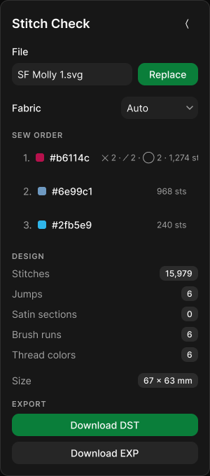
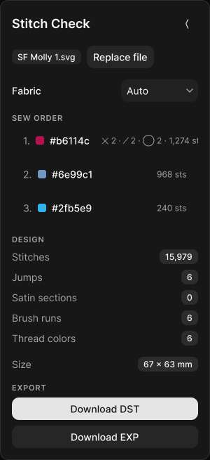

# Design: retire-umbrella-switches

## Context

The converter panel grew three all-or-nothing stitch switches before the
`st-` tag vocabulary existed. Each applies one decision to every shape in
the file, so a global switch and a per-shape declaration can disagree —
and until PR #485 the switch won silently. This change removes the
switches and lets the design file speak for itself.

The surface is `app/svg-to-stitch/page.tsx`: a 300 px panel floating over
a full-viewport canvas, rendered in `.mvds-theme` — MVDS 0.3.0's own dark
palette, deliberately not the hub skin (`app/svg-to-stitch/layout.tsx`).

## Goals / Non-Goals

**Goals:**

- Remove every control that changes stitch type for more than the shape
  it names.
- Keep the panel's remaining job intact: what am I making (size,
  fabric), what will it sew (sew order, stats), and getting the file out.
- Leave untagged output byte-identical to today.

**Non-Goals:**

- Building the per-colour-block angle / stitch / density controls the
  founder wants in the sew-order list. That is the next change; this one
  clears the surface that would contradict it.
- Touching **Fabric** (preview backdrop) or **Design size** (a
  per-conversion choice the authoring contract keeps in the panel).

## User flow / IA

Unchanged in shape, shorter in practice. The panel reads top to bottom:
file → design size → fabric → sew order → design stats → export. Removing
the switch cluster and the two fill selects takes the panel from 968 px
to 728 px tall. The three switch rows sit above **SEW ORDER**, so it
lifts 144 px — the part a stitcher actually reads before sewing moves up
by roughly its own height.

Nothing moves, nothing is renamed, nothing changes place. Five rows leave.

The logic behind the panel simplifies in the same direction — see the
decision flow in `proposal.md`, built on Figma page `03 Decision flow`
(node `11:3`).

## Visual design / Figma

| Item                | Value                                                                                                                                                                                                                                             |
| ------------------- | ------------------------------------------------------------------------------------------------------------------------------------------------------------------------------------------------------------------------------------------------- |
| Primary file URL    | <https://www.figma.com/design/hHAppz4A23qMoLQFTo8QAc> ("svg-to-stitch — retire-umbrella-switches")                                                                                                                                                |
| As-is frame(s)      | `01 Current state` → `Current state · Desktop 1024` (node `8:123`), panel `8:12` — the shipped panel rebuilt from geometry measured off the running page, not from reading the JSX                                                                |
| Proposed frame(s)   | `02.1 Proposed — rebuilt from measured production` → `Proposed v2 · Desktop 1024` (node `8:131`), panel `8:132` — cloned from the as-is so the only difference is the five removed rows                                                           |
| Libraries / version | **MVDS Core** (library key in `rules/figma.mdc`) — `Badge` and `Switch` imported by key, the same two instances the `stitch-brushes` panel used. MVDS's `Tokens` collection is pinned to its **Dark** mode on each panel, matching `.mvds-theme`  |
| Local variables     | `hub tokens` collection on `00 Components` — 11 colours converted from the oklch declarations in `app/globals.css`; panel and text fills are bound to them rather than hardcoded                                                                  |
| Code Connect        | No mappings to update — no component is added, changed or renamed                                                                                                                                                                                 |
| Breakpoints         | S · 480px / L · 1024px. One frame per state is sufficient: the panel is `width: 300; maxWidth: calc(100vw - 24px)`, so at 480px it is still 300px wide and renders identically. Only below 324px would it clamp, which is off the supported range |
| Status              | Built 2026-09-17 — **not approved**; three open proposal rounds                                                                                                                                                                                   |

**File convention** (per `rules/figma.mdc`): numbered pages, and each
later proposal iteration becomes a **new** page — `02.1 Proposed — <what
changed>` — never an edit to an existing one.

**Iterations on this change:**

| Page                                                           | Round      | What it holds                                                                                                                                                                                                                                                    |
| -------------------------------------------------------------- | ---------- | ---------------------------------------------------------------------------------------------------------------------------------------------------------------------------------------------------------------------------------------------------------------- |
| `02 Proposed`                                                  | v1         | The first proposal, built by reading the JSX — wrong on composition (rows that wrap, chevrons, stacked export buttons)                                                                                                                                           |
| `02.1 Proposed — rebuilt from measured production`             | v2         | The same removals, drawn from geometry measured off the running app                                                                                                                                                                                              |
| `03.1 Proposed — size declared in the document`                | v3         | Also removes **Design size**, after the founder settled that the document declares physical size (`st-size`, mm ×10). Numbering continues past `03`, which holds the decision-flow diagram                                                                       |
| `03.2 Proposed — file row on the input pattern, brand buttons` | v4, latest | Founder edits to the file picker carried forward: the filename reads as an input and **Replace** as a button, both on the label-and-control pattern the other rows use. The primary button treatment adopts the brand green, captured as a `brand-primary` token |

The convention was briefly broken: when v1 was rejected, its page was
cleared and rebuilt in place instead of a new page being added. That is
corrected — `02` and `02.1` both exist and can be compared — but page
`02` is a faithful reconstruction of the first round from its original
build script, not the untouched original frames. Later rounds go on
`02.2`, `02.3`, each a new page.

### Fidelity check

The first as-is frame was rejected by the founder — "this figma doesn't
match the current ui — especially the key value pairs with dropdowns or
toggles". It had been built by reading the JSX, which got the
composition wrong. The rebuild measures the running page instead:
element boxes, font sizes, radii and computed colours pulled off
`labs.beckharrisdesign.com/svg-to-stitch`, then reproduced.

What reading the code missed, and measuring caught:

| Element             | Assumed                      | Actual                                                          |
| ------------------- | ---------------------------- | --------------------------------------------------------------- |
| **Design size** row | label left, control right    | **wraps** — label on its own line, 199 px select beneath        |
| Select trigger      | small pill, no affordance    | 32 px tall, radius 10, white @ 4.5%, **chevron** right          |
| Sew-order rows      | text rows                    | full-width 44 px buttons, radius 10, 16 px side padding         |
| Export buttons      | side by side, both secondary | **full width, stacked**; DST the light primary, EXP secondary   |
| Labels              | 13 px regular                | 14 px medium (`Label`); stats 14 px regular (`CardDescription`) |
| Stat badges         | solid fill                   | neutral at **15%** alpha                                        |

`SelectRow` is `Inline … wrap`, so whether a row wraps depends on whether
its label and control fit in 266 px — which is why **Design size** wraps
and **Fabric** does not. That is emergent behaviour that reading the
component could not have revealed.

The imported MVDS `Badge` and `Switch` also resolved the library's
**Light** mode on import — the switch rendered a dark track where
production renders a light one. Both panels now pin `Tokens` to **Dark**:
file badge `#262626` on `#fafafa`, checked switch `#e5e5e5` track with a
`#0a0a0a` knob, matching the measured values.

The clipped composition on sew-order row 1 is **not** a drawing error —
production clips it the same way (`whiteSpace: nowrap`, no horizontal
scroll). The frame reproduces the bug rather than quietly fixing it.

## Decisions

1. **The proposed frame is a clone, not a rebuild.** A reviewer should
   be able to flip between the two pages and see only absence. Rebuilding
   invites incidental differences that read as proposals.
2. **Fill angle / density are hidden, not deleted.** The converter keeps
   both options at 45° and 0.4 mm and `a`/`d` tags still override them
   per shape, so the change is reversible and output is untouched.
3. **One breakpoint frame per state.** Stated above: the panel is
   width-fixed across the supported range, so a 480px frame would be a
   duplicate, not a second design.
4. **No new components.** Everything in the proposed frame already
   exists; the change is subtraction.

### Latest round — `03.2`

`03.1` moved size into scope: 968 px → 728 px → 655 px. `03.2` then
reworks the file picker and the button treatment, from founder edits made
directly on `03.1`.

The file row now takes the same shape as every other field — a label,
then its control — with the filename rendered as an input and **Replace**
as a solid button, rather than a badge sitting beside a quiet one. The
primary button treatment takes the brand green (`#0a7e3a`), captured as a
`brand-primary` variable in the `hub tokens` collection so it is a token
and not a literal. Secondary (**Download EXP**) is untouched.

Two things flagged rather than assumed:

- **Two primaries.** **Replace** and **Download DST** are both brand
  green now. Replace is a utility; the download is the point of the
  tool. One of them probably wants to be secondary.
- **Replace is shortened** from "Replace file" so it fits beside the
  filename. If the full label matters, that row wraps instead.

The composition before those edits, with size newly out of the panel:

Everything left is either a fact read from the file — sew order, design
stats, size — or a preview control that changes nothing about the
stitches (**Fabric**). The panel stops being a place where decisions are
made and becomes a readout with an export button. Size needs no new
affordance: the **DESIGN** section already reports it, which is the right
treatment once it is an outcome of the document rather than an input to
the tool.

**Nothing in the file is approved.** `02 Proposed`, `02.1`, `03.1` and
`03.2` are all open rounds.

## Risks / Trade-offs

- **Un-prepped art loses its quick audition.** Flipping **Fill shapes**
  off was how you looked at a bought SVG another way without editing it.
  After this, changing that file's behaviour means tagging it. Accepted
  in the proposal; worth re-checking the first time a bought file needs
  work.
- **The panel becomes mostly a readout.** Once the switches and selects
  are gone, almost everything left is information rather than control.
  That is the correct shape for a tags-first tool, and it is also why the
  founder's per-group controls want to live in the sew-order rows — but
  it does mean a user who expects knobs will not find any.
- **The sew-order row is already at its layout limit.** A thread
  carrying all six motifs overflows its row today (`whiteSpace: nowrap`,
  no horizontal scroll), clipping the stitch count. That is tracked
  separately, and it constrains the per-group controls that are meant to
  land in those rows.
